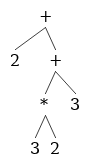

#Compilers

A compiler is a program that takes your code (like C or Go) and turns it into a file containing only 0's and 1's.  These 0's and 1's can then be run on a computer.  A compiler consists of 5 stages:  Lexing, Parsing, Semantic Analysis, Optimization, and Code Generation. 

What are interpreters?  How are they different from compilers?

An interpreter takes your code and just runs it without outputting a binary file.  It still does the same job of turning your code into 0's and 1's, however.  So running a binary file output from a compiler will be faster than running a source file through an interpreter.

However, that doesn't mean interpreters aren't still useful.  Look at this link to find out why:

https://www.quora.com/Why-do-we-use-interpreters-instead-of-using-compilers-for-everything-Is-platform-independence-the-main-reason

#Lexing

Imagine you wrote this program:

	while (true):
		print(i)
	
To a compiler, your program currently looks like an array of characters: 
	
	[ w, h, i, l, e, (, t, r, u, e, ), :, p, r, i, n, t, (, i, ) ]
	
As they are, the compiler has no idea what these characters mean.  The first part of the compiler is called the lexer.  It takes this stream of characters and turn it into a stream of tokens, like so:

	[ while, (, true, ), :, print, (, i, ) ]
	
A token is a blob of characters that has meaning in your programming language.  None of 'w', 'h', 'i', 'l', or 'e' have meaning individually, but 'while' does.  

All tokens have a value.  Most tokens values are identical to their names, like 'while', '(', and 'true'.  Other tokens, like strings, numbers, and variables have values different from their names.  Here's another example program:

	x=4;
	
and here is the token output when a lexer reads this program:

	[ ID='x', =, INT=4 ]
	
In practice, the token name ID usually denotes variable names, function names, and class names.

How do we know that 'while' is a WHILE token?  How does the lexer know not to output 5 ID tokens?

Lexers use the maximum munch rule.  The maximum munch rule means that the lexer will create the biggest tokens it possibly can.  So first it sees a 'w', and thinks "this could be an ID... I'll keep going".  Then it sees an h, an i, an l, an e, and a (.  Then it thinks "Ok, I know that 'while(' isn't a possible token, so the biggest token I can make is 'while'.

The lexer knows to make 'while' a WHILE token, and not an ID='while' token through precedence rules, which are hard-coded.  So when it sees a 'while', it thinks "this could be an ID, or it could be a WHILE token.  Since WHILE takes precedence over ID, I'll make this a WHILE".

 

Now, how do we actually code a lexer?  In other words, how do we create a program that will clump characters into tokens?  The answer is with regular expressions, or regex.  Regex describe patterns of characters using 3 operators:  Grouping, Boolean OR, and Quantification.

	Grouping:  r"ab" matches the string 'ab'
	Boolean OR:  r"a|b" matches the string 'a', or the string 'b'
	Quantification:  r"a*" matches the string '', the string 'a', the string 'aa', ... to infinity a's
	
You may have seen other regex operators in Java or Python, like + or ?.  These operators are just shortcuts of the 3 operators above.  `a+` is equivalent to `aa*` and `a?` is equivalent to `a|`.

We use regex to decide whether some string matches a pattern.  If we had a big file called X.txt, and we wanted to know if it contained only numbers, we could do it with regular expressions in python like this:

	import re
	
	regex01 = r"[0-9]+" #shorthand for (0|1|2|3|4|5|6|7|8|9)(0|1|2|3|4|5|6|7|8|9)*.
	                    #There's two (0|1|2|3|4|5|6|7|8|9)'s because we want at least 1 digit.
	
	X = open('X.txt', 'r').read() #The file X.txt has been read into the string X
	
	if re.match(regex01, X):
		print("Match")
	else:
		print("No match")
		
So if X.txt contained something like `98560134760976`, then "Match" would be printed out, but if it contained something like `3704974320ABC947523`, then "No match" would be printed out.  But rather than printing things out, a real lexer would call a function that would emit a token; something like `emitToken(tokenName, tokenValue)`.  For this example, rather than calling `print("Match")` we would call `emitToken(INT, 98560134760976 )`, which would emit an INT token object whose value was 98560134760976.
		

Can regular expressions match anything?

Regex can match a lot of patterns, but there are certain patterns it can't match that we need to make a real programming language.  Consider C, or Java.  These languages require parenthesis and curly braces to be balanced, which means for every '(' that opens up a new scope, there needs to be a ')' to close the scope.

Now see if you can think of a regular expression that can match '()', '(())', '((()))', '(((())))', etc, all the way up to an arbitrary number of parenthesis, _without_ matching anything unbalanced, like '(()', '(()))', etc.  Your first thought might be something like `(*)*`, but that would end up matching '(()' and '(()))'.  Next you might try something like `()|(())|((()))|(((())))|....` Which is a good effort.  You could make a regex expression that could match balanced parenthesis in the hundreds, thousands, millions, or beyond, but you can never create a regex expression that can match an arbitrary number of parenthesis.  But the parser will take care of that, so our lexer doesn't have to worry about it.

What about python?  It doesn't have parenthesis at all.

While python doesn't have parenthesis, it still uses 'balanced' whitespace in order to define scope, which ends up being the same problem.  

 

#Parsing

Look at this python program:

	y = f(4)                                      #line 1
	....                                          #line 2-199
	def f(x):                                     #line 200
		if x != 4:                                 #line 201
			print("that's not my favorite number") #line 202
			explode()                              #line 203
		else:                                     #line 204
			print("I cannot accept this gift")     #line 205
			return 4                               #line 206
	def explode():                                #line 207
		return 1 / 0                               #line 208
	
	
This program, like most, does not execute in order, e.g executing line 1, then line 2, then line 3, etc.  It starts at line 1, then jumps to line 200, then line 201, then line 204, 205, 206, then back to 1 before continuing.  

When our lexer turns the above program into a token stream, we get:

	[ ID=y, =, ID=f, (, INT=4, ), .... ]
	
The structure of this token stream is linear.  Line 1, line 2, line 3, etc.  It doesn't give us any information on how to actually execute the program.

A parser turns a stream of tokens into a tree of tokens.  A tree's structure is non-linear; it can tell us more about the order in which a program will execute.

Even simple programs usually require some kind of tree structure.  Here is another example:

	2+3*2+3

and its token stream:

	[ INT=2, +, INT=3, *, INT=2, +, INT=3 ]
	
If our computer tried to execute this program token by token, these would be the steps it would take:

	2
	2+
	2+3
	5
	5*
	5*2
	10
	10+
	10+3
	13
	
Considering that 2+3*2+3=11, this is not the behavior that we want.  Computers are stupid.  They don't know that multiplication comes before addition.  If we instead take our token stream, and run it through a parser that understands our tokens, we would get an output like this:

Our computer will traverse this tree inorder.  In actual code, the parse tree would look like this:

	( +
		2
		( +
			( *
				3
				2
			)
		)
	)
	

Wait, this looks like Lisp/Scheme...

That's because it is, basically.  Putting the tree all on 1 line, you would get `(+ 2 (+ (* 3 2) 3 ) )`.  You could copy and paste this exact line into a lisp interpreter / compiler and it would run successfully.  

In Lisp, you are basically skipping lexing and parsing almost entirely by directly creating the parse tree.  Supposedly this makes Lisp more powerful.  By powerful I don't mean computationally powerful, as in it runs faster.  I mean linguistically powerful, as in you can express computational ideas in a much more concise manner than, say, C++, Java, or Python.  Of course, this is a very difficult thing to quantify, or prove, but there is a very devoted community of Lisp users that swear by its almighty power.

Another note is that since Lisp mostly skips lexing and parsing, it can be compiled faster than pretty much any other high-level language.  However, I can't remember where I found the benchmarks that prove it.

		
Notice now that the multiplication 3 * 2 will happen before the addition 2 + 3, which is what we want.  

Once we have a parse tree for the input program, that program definitely has some semblance of sense.  It may still have errors in it, but the program is speaking a language that we understand.  Let's get a sense of where we are with some metaphorical compilations of English:

`asdfasfasdf`  This is complete gibberish, and means nothing.  Fails at the lexing stage.

`is was of I pancakes`  While each individual word (token) makes sense, they don't form a grammatically correct sentence.  Fails at the parsing stage.

`The goats mustache is Cameron Diaz`  Ok, we have a grammatically correct sentence, but we're missing something.  'The' goat?  What goat are we talking about?  Who is Cameron Diaz?  I don't know who they are, but I know a human can't be a goats mustache.  Fails at the semantic analysis stage.

`I must proceed at high velocity` Now we're getting somewhere.  Each token makes sense, and together they form a parse tree that tells us that 'I' absolutely need to move very fast.  This is a valid program, and should be able to run.  If the optimization or code generation stages fail, that's an error in the compiler, not an error in the users program.

So once we have created a parse tree for our input program, it is either a 'goats mustache' or a 'high velocity' program.

However, we still don't know how to create a parser.  To do that, we need to learn more about formal language theory.

`Formal Languages`  A formal language is the set of all possible sentences that follow some set of rules.  Validity is not disputed in formal languages.  Let's say you invent a language, and someone asks you 'Is this paragraph written in your language?'  If you can use the rules of your language to prove with 100% certainty that the paragraph is valid (it is written in your language) or invalid (it is not written in your language), then your language is a formal language.

Java and C are formal languages.  If you compile some text and the compiler throws an error, the text is not a valid program.  If the program compiles and runs, it is a valid program.

English is not a formal language.  English has rules, but there are definitely words and phrases that are arguably valid or invalid.

What if the program compiles, but has a runtime error?  Is the program valid?

Yes.  A runtime error, like a stack overflow, is a problem with the hardware of the machine.  If we had more memory, that error would not have occured.  So it's a problem with your language.

 

`Formal Grammar` formal grammars are the rules of formal languages.  The formal grammar rules in our parser are what turn the token stream into a token tree.  Our parser will use a specific kind of formal grammar known as a context-free grammar.

`Context-Free Grammar` CFGs are a subset of formal grammars.  Formal grammars use backus nar form to describe their rules.  

Example of a CFG in backus nar form:

	S -> x | xT
	T -> y | z
	
Formal grammars do the same thing that regular expressions do: they look through strings and return either true or false depending on whether the pattern matches or not.  

The above grammar will match the strings 'x', 'xy', and 'xz', and won't match anything else.
	
All formal grammars have:

A set of `terminal symbols`.  A terminal symbol is the smallest unit of meaning in a language.  Think of terminal symbols as single words.  The terminal symbols in our example are x, y, and z.  The terminal symbols in our compiler will be the tokens from our lexer. 

A set of `nonterminal symbols`.  A non-terminal symbol is just a symbol that can be broken down into a combination of nonterminal and terminal symbols.  In our example, S and T are non-terminal symbols.  S can be broken down into either x, or xT.  T can be broken down into either y or z. 

A set of `production rules`.  Production rules tell you how to break down nonterminal symbols.  S->x is a production rule, S->xT is a production, T->y is a production, and T->z is a production.  S-> x | xT is not a production, it is 2 productions.

A `start symbol`.  A start symbol is just the nonterminal where you start parsing.  It's either denoted with S, Start, or it should be clear enough without explicit statement.

Here's another example:

	S -> (S) | epsilon
	
epsilon is a stand in for the empty string.  This grammar can match nested balanced parenthesis, which regex can't do.

Couldn't we do the S and T example with regex?

Yes.  A regular expression is actually a kind of formal grammar, and more, its a kind of context-free grammar.

All regex expressions have an equivalent backus-nar form.

Example regex:

	([A-Za-z])([A-Za-z0-9*])
	
Example equivalent backus-nar form:

	S -> Alpha T
	
	T -> Alpha T | Num T | epsilon
	
	Alpha -> A|a|B|b|C|c|D|d|E|e|F|f|G|g|H|h|I|i|J|j|K|k|L|l|M|m|N|n|O|o|P|p|Q|q|R|r|S|s|T|t|U|u|V|v|W|w|X|x|Y|y|Z|z
	
	Num -> 0|1|2|3|4|5|6|7|8|9
	
Our lexer is just a formal grammar.  It's terminals are individual characters, it's non-terminals are the tokens it outputs. Its start symbol is all of the tokens OR'd together, but we don't care about it.

Yeah, we could combine regex with backus nar form (thereby combining the lexer and the parser), but its better to keep them separate for a multitude of reasons.  Most of those reasons can be boiled down to 'it makes the implementation look ugly'.  There's also the fact that separating it into a lexer and parser lets us pipeline the two parts easily.  Also, it makes the whole 'parsing english' metaphor clearer, and therefore easier to understand conceptually.

So really the difference between regex and CFGs is that regex is just a special kind of CFG that is really easy to express.

***
ambiguity

derivation

LR / LALR

In practice, your grammars won't be context-free.  But since context-free grammars take O(n) time to parse, you want to make your grammar as close to this as possible.  Give an example of when a context sensitive grammar would take like O(n^2) or something.  show that a regular grammar parse tree is a stick or something.  So you can't have anything like ifs, fors, anything more than local scope with regular grammars.  Give an example of when C/C++ are context sensitive, and why those examples don't result in too bad slow down.  Also say how you would solve that problem?
***

`Bottom Up Parsing`

Rather than starting at the start symbol and eventually deriving the terminals, we start at the list of terminals and condense them into the start symbol.  Bottom Up parsing is just as fast as LL(1) parsing, and also doesn't require a left-factored grammar.

Imagine when you built the parse tree for top down parsing.  You started at the root note, and expanded it out over and over until you got to the leaves, leftmost first.  With bottom up parsing, instead imagine all of the leaves, unconnected.  Then connect them together, starting at the leftmost leaves, and doing this until you have created a root node and everything is connected to it.  Hit rewind and you get a rightmost derivation.  Well, not exactly rewind.  You're not erasing connections between nodes.  The reverse rightmost derivation analogy isn't that important, I don't think.

Actually, when you imagine the string of terminals, start connecting them / reducing them downward.  Don't build up.  Then maybe the analogy will be more clear.

`Shift Reduce Parsing`

A kind of bottom up parsing.  Say that `aBw` is what we currently have in our parse.  Now assume `X->B` is the next step.  Remember that this means we will replace `aBw` with `aXw`, since it's a bottom up parse and we're going in the reverse direction we normally would.  Anyway, assuming `X->B` is next, then we know `w` must be a string of terminals, with no non-terminals in it.  This is because we're going left to right.  If someting is on the right of what we are currently working on, we haven't touched it yet.  So we haven't touched any of `w` yet, which means it's a bunch of terminals.

So knowing that everything to the right of our rightmost non-terminal is a bunch of terminals, we are going to separate our string thing into 2 parts with a |, like so:  `aX|w`.  Everything to the left we have seen so far, and is composed of terminals and non-terminals, and everything to the right we have not seen yet, and is composed only of terminals.  

Shift reduce parsing gets its name because it only has 2 possible actions:  shifting and reducing.  We've already seen reduce moves:

	aB|w -> aX|w
	
We haven't seen shift moves yet.  A shift move is simply reading the next 1 token of input:

	aX|w -> aXw|
	
Note that in this example, w is a single terminal, though in previous examples it was multiple terminals.

	E -> T + E | T
	T -> int * T | int | (E)

example:
	
	|int*int+int
	int|*int+int
	T|*int+int //MISTAKE
	
You shouldn't reduce to T because `T * int` doesn't exist in this grammar, meaning that if you make that last reduction, you'll never get back to the start symbol.  If instead you did:

	|int*int+int
	int|*int+int
	int*|int+int
	int*int|+int
	int*T|+int
	
That would be fine, because `int*T` is in the grammar, and can be further reduced.  So just because you _can_ make a reduction doesn't mean you _should_.  But how do you know when to reduce and when to shift?

When you reduce, that's when you put stuff together in your tree.  When you shift, you add a new token to the bottom of the tree.

What about the first 2 productions of T?  If those are both in a dfa state, and you transition and consume an int, what goes on the stack?  Is that a shift reduce conflict?  Yes, it is.  This is when you look in the follow of T.  If the next thing is in the follow of T, put the reduce on the stack.  If the next thing is the first thing to the right of your . in the item, put the shift on the stack.  

`Handles`
A handle is a prefix of a string that is safe to reduce.  So in the previous example, we encounter our first handle at `int*int|+int`, where the second `int` is the handle.  

`Recognizing handles`
On most CFG's, there's no efficient algorithm for recognization.  However, just like with predictive parsing, there are certain subsets of CFG's that make it simple.

A viable prefix is on the left of a |.  
A viable prefix is a prefix of THE handle.(?)  
If there's at least 1 viable prefix, there's no parsing error.
Just a name, not super deep.

Important:  the set of viable prefixes is a regular language.

insert circle graph thing here with LR grammars. 

Handle
Prefix (is he actually talking about viable prefixes?)
viable prefix
item
stack of prefixes

algorithm is stack nfa, nfa->dfa, dfa is table driven.  We leave it as an nfa because it's simpler to write.
Uses items for each state, I think.  The stack is a sequence of partial right-hand sides.

Maybe explicitly say that you're going to skip all the weird definitions and just show the algorithm.

For the NFA, notice there are states

	E->.T
	E->.T+E
	
Both of these are allowed, since we are in an NFA.  We simply say that we are in both states until proven otherwise.  If you wanted a DFA, you would do what you did before:  combine the common parts into 1 element.

But wait, how are we doing this using NFA's?  I thought only regular expressions could be NFA's?  Need to explain the prefix thing.  How does that work?  We MUST be leaving something out.  Try the nested parens example again.  Hm...the nfa is based on the stack, and the stack is implemented through your CFG.  So it's not your grammar that's being translated into an NFA, it's the grammar tree thing, I think.

NFA starts at the start symbol, then you immediately slide down all the epsilon moves, and you're in all the states that don't have any epsilon transitions out.  These states will be states like `T -> (E)` that have a terminal as the first thing in their production.

DFA example just shoves all the NFA states into 1 thing.  This isn't how you actually do it, since if you want to know if you have to shift / reduce, you have to look at every item contained in that state, which isn't actually O(n).  You would have to separate all of these states by left-factoring.  It's just not done for simplicity.

reduce/reduce conflict if a state has 2 reduce items

shift/reduce if any state has a reduce and a shift item

there is no such thing as a shift/shift conflict.  If more than 1 can shift, you can just do it.  No need to choose, since they're all shifting by the same terminal.

shift items look like:  `X->B.`, `Y->w.`
reduce items look like: `Y->w.tf`
Shift items all have the . at the end because you are done with the production and so should shift in a terminal from the unseen part.

Note that shift/reduce conflicts don't require that you change your grammar or whatever.  You could always just split it into 2 threads, and which ever one lives, wins.

Note that could be important:  while this shift reduce stuff is kind of annoying, the whole shift/reduce and reduce/reduce conflicts may actually be useful to know.  After all, a GLR parser will stil have conflicts, and will probably report them.  Fixing these conflicts will result in faster parsing.

SLR parsing
Add 1 new rule:  Reduce by X->B if t in Follow(X).  This is in addition to the other rules.
'If there are conflicts under these rules, the grammar is not SLR'.
I think this solves shift reduce conflicts?  Maybe?

Previously, you run the DFA on the entire stack over and over.  Faster to not do that.  Remember that the stack is full of prefixes?  Now it's full of prefixes, and each of those prefixes has an accompanying DFA state.  Now you can easily get back to where you were, and don't have to start the DFA over from the beginning.

now you have 2 parsing tables:  goto, which tells you the next dfa state to go to , and action, which tells you what to do on your stack, shift, reduce, error, accept.

How to do the algorithm with the NFA / DFA.  How it corresponds with the tables / with the parse tree.  Use the chart to explain that you're going to ignore a lot of bottom up parsing stuff.  Forget handles, valid items, etc.  Explain how you make the table.

***
Just do the algorithm now, and annotate as you go along

transitions are made based on the top of the stack.  Since the stack can have both terminals and non-terminals, that's how we get a dfa.

The upcoming terminal is to determine whether to shift or to reduce.  It is also used to determine what transition to take if you are reducing (in other words, if you need to know what is in the follow of the top of your stack).

goto[i, A] = j if state i ->(A) state j.
If you're in state i, and A is the symbol on top of the stack, go to state j.  This is our DFA table.  To be clear, our DFA table doesn't tell us how to make the parse tree.  We also have an action table that depends on our DFA table, and tells us how to make the parse tree.

action[i, a] = shift / reduce
If you are in state i, and terminal a is the first thing to the right of the |, then you shift a into the left.

So you combine the goto and action tables together, putting the tuple <a, j> onto the stack.

3:42 of SLR improvements has the whole algorithm.

#Misc

http://trevorjim.com/python-is-not-context-free/

TODO

Figure out how to concisely explain epsilon, and where.  Probably in the lexer phase.

put your goats mustache example up at the very top.  Then at each stage, use that example to give them a sense of what this stage of the compiler does.  Also add these in:
optimization:  this stage is optional.  Makes code easier for computer to execute.  'I must proceed at high velocity' becomes 'Gotta go fast'.
code generation:  'Gotta go fast' becomes '010100100101001010010101001' (but make it accurate).  

Here are some things context free grammars can't do.  If a grammar is like this, it's context sensitive.
But we can just do some quick hacks like this and pretend that our grammar is still context free.
It's important to keep our grammars as close to context free as we can, since they can be parsed in O(n) time.  Context sensitive takes O(n^2) time.  So technically the grammars we make here take O(n^2) time, but just for a few operations, so in practice our parser and lexer will seem like it only takes O(n) time.

I feel like if you explain simply why LL(k) grammars don't matter, and more generally why you only ever need 1 token of lookahead, then all the rest of this stuff should fall into place.  Just simply explain why 1 token of lookahead should be all that is necessary.  Then, once you understand that only 1 token of lookahead is ever needed, explain why that's not entirely true, and that you USUALLY only ever need 1 token of lookahead.  GLR parsers USUALLY only look ahead 1 token.  And cut down on the definitions.
Once you compare all of these definitions and really hone in on what this stuff is, you should be able to figure out the perfect tools and implementation for your grammar.

Give a really quick overview of the parts of a compiler.  Lexer, parser, semantic analyzer, code generation.
Explain that assembly is binary.  Recall your 61C project where you made a processor that ran on binary.

explain regex and automata.  "in your head, you separate the tokens like this:  (for) (x) (in) ... but for all the computer knows the tokens should be separated like this: (f) (or x) (i)(n) ..."

Need good image manipulation software.  Much easier than the slideshow you made.

explain recursive descent

recursive descent algorithm limitation (logical or shortcircuitting)

left recursion

left factoring

first and follow sets

Consider trying to figure out some kind of step-by-step for certain things.  Like examples.  Consider the follow set example.

Oh, the first and follow set examples:  maybe give them the way to do it by hand?  No need to show them the computer code to do it.

Shift reduce parsing takes n time without needing to do all that grammar shifting around that recursive descent needs.  

https://stackoverflow.com/questions/3922699/what-is-the-runtime-difference-between-different-parsing-algorithms

Interesting.  Very strange as well.  But ugh.  There's just so much.  I feel like conceptual simplicity matters the most.  Which means you should use a lexer and parser generator.  Bison uses shift reduce, so you should learn shift reduce.

