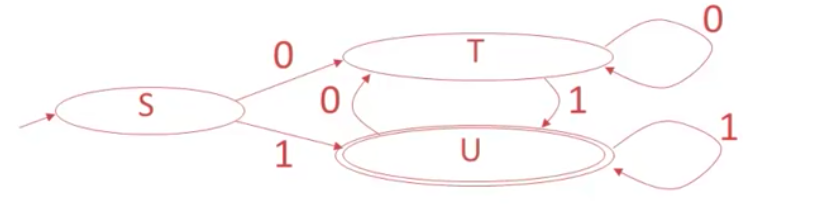

#Compilers

Notation

We'll start off with this example:

	E -> T | T + E
	T -> int | int * T | (E)

`grammar` the whole thing

`E, T` nonterminals

`int, *, (, )` terminals

`E -> T` the first production of E

`T -> int * T` the second production of T

`|` used to separate the productions of the nonterminals

`->` E can be converted to T

`->*` X can be converted to Y in ? steps

DFA to Table Driven

Consider this regex of all binary strings that end in 1:

	(1|0)*1

Whose DFA implementation is as follows:	

We can convert this DFA into a table.  A table is easy to implement in code, as well as fast.  Here is a table equivalent to the DFA:

         | 0 | 1 |
      ---|---|---|
 _**S**_ | T | U |
 _**T**_ | T | U |
 _**U**_ | T | U |
 
 Say we have the input `0101`.  We are in state S, and the next input is 0, so we look at row S, column 0, whose entry is T.  This means we are now in state T.  
 
 The next input is 1, so we look in row T, column 1, whose entry is U.  Now we are in state U.  
 
 The next input is 0, so we look in row U, column 0, whose entry is T.  Now we are in state T.
 
 The next input is 1, so we look in row T, column 1, whose entry is U.  Now we are in state U.
 
 There is no more input, so we are done.  One thing that isn't in table that we need to somehow specify is that U is an accepting state, and S and T aren't.  Implemention is trivial and will be omitted :^)
 

Recursive Descent

Easiest type of parsing.  Takes almost any context free grammar (left recursive and something else don't work without some kind of modification).

Example Grammar

	E -> T | T + E
	T -> int | int * T | (E)
	
Example Functions

	bool Term(Token tok) { return *next++ == tok; }
	
	bool E() { 
		Token *save = next;
		
	
	bool E_1() { return T(); }
	bool E_2() { return T() && term('+') && E(); }
	
	bool T_1() { return term(INT); }
	bool T_2() { return term(INT) && term('*') && T(); }
	bool T_3() { return term('(') && E() && term(')'); }
	

Predictive Parsing and LL(k) grammars

Predictive parsing is a confusing term.  Saying that you have a 'predictive parser' is not a statement about your parsing algorithm (recursive descent, shift reduce, etc).  Saying that you have a predictive parser means that the grammar your parser reads is an LL(k) grammar.  LL(k) grammars are a special kind of context-free grammars.  By looking at the next k tokens, we can narrow down the possible productions to 1 at every step.  This means there will never be any backtracking.

Here is an example of a normal context-free grammar:

	A -> aaaa | aaab
	
Let's say we get the input `aaab`.  This grammar starts at the first production of A, matchs the first, second and third `a`, then hits `b` and has to backtrack.  Starting over at the first `a`, the parser matches the input with the second production, and we're done.

Here's an LL(k) grammar that parses the same language as above:

	A -> aaaX
	X -> a | b
	
In this grammar, k=1 because you only have to look at the next token to decide whether or not to keep parsing or error out.  For our input `aaab`, we match the first 3 `a`'s one at a time, then look at X.  `b` doesn't match X's first production, so we go to X's second production and get a match.  This is better than the first grammar because we only had to match `aaa` once.

So LL(k) grammars don't have to backtrack, unlike most context-free grammars.

Random facts:

All context-free grammars have an LL(k) equivalent.  Tools like ANTLR can transform context-free grammars into LL(k) grammars automatically.

In practice, we'll always be looking at LL(1) grammars. LL(k>1) grammars don't matter.

LL(k) vs regular grammars

Consider this grammar that parses nested parenthesis:

	E -> (E) | epsilon

Regular grammars can't describe nested parens.  So LL(k) grammars are more general that regular grammars.  

LL(k) grammars can be parsed in linear time just like regular grammars, unlike non-LL(k) context-free grammars.

LL(1) Parsing tables

Remember how we converted DFA's into tables?  Tables are simple to implement in code, and fast to execute.  Now we want to make a parsing table for LL(1) grammars.  

In the DFA table, we had a current state, and a next token which would determine our next table lookup.  In our LL(1) table, we have a current non-terminal instead of a current state.  Each table lookup has this form:

	T[A, t] = X
	
`T` is the table, `A` is the current non-terminal, `t` is the next token, and `X` is the terminal or non-terminal that we replace A with.

In order to create the parsing table, we need to find a B for every combo of A and t.  We can find these X's by computing the first and follow sets for each A.

First Sets

`T[A, t] = B` if t is in the first set of B.  
The first set of a non-terminal B is the set of all terminals that appear first in B's derivation.

	A -> Bx | Cy
	B -> 0 | 1
	C -> a | epsilon
	
In this grammar, the first sets of A, B and C are:

	A : { 0, 1, a, y }
	B : { 0, 1 }
	C : { a, epsilon }
	
B and C are trivial, so I'll skip those.  A's first set looks like it does because when A is derived all the way down to terminals, it could look like any of the following:

	0x
	1x
	ay
	y
	
Since we want the first terminal that can be derived from A, we end up with 0, 1, a, and y.

So if we're at A, we will transition to B if `t=0` or `t=1`.
TODO I this is wrong.  What happens after we get to B?  We just die.

In general, finding the first sets for each terminal and non-terminal in a grammar is as follows:

	t : { t } // if t is a terminal symbol
	First(Y) is a subset of First(X) if X -> Y....
		or X -> ABCY....
			and A, B, C can all be epsilon.
	epsilon is an element of First(X) if:
		X -> epsilon
		or
		X -> ABC
			and A, B, C can all become epsilon

Follow Sets

Here's the definition of a follow set for non-terminal X:

	Follow(X) = {t | Y ->* AXtB }
	
What this says is that t is in Follow(X) if Y's multiple-step derivation contains X, and also has some terminal t after it.  

The start symbol S's follow set will contain only `$` (end of file).

Now we'll compute follow sets for this grammar:

	E -> TX
	T -> (E) | int Y
	X -> +E | epsilon
	Y -> *T | epsilon
	
At the start, we have an empty set for E, T, X, and Y.  We'll say E is the start symbol, so E's set now contains `$`.  Then, starting at E's productions, we do the following:

Computing Follow Sets example

In this example, keep in mind the final First Set from the previous example.

Step 1:  Start at E

	Follow(E) = { $ }
	Follow(T) = { }
	Follow(X) = { }
	Follow(Y) = { }
	Follow('(') = { }
	Follow(')') = { }
	Follow('+') = { }
	Follow('*') = { }
	Follow(int) = { }
	
Step 2:  Look at E -> TX

	Follow(E) = { $ }
	Follow(T) = { First(X) }
	Follow(X) = { }
	Follow(Y) = { }
	Follow('(') = { }
	Follow(')') = { }
	Follow('+') = { }
	Follow('*') = { }
	Follow(int) = { }
	
Step 3:  Look at T -> (E)

	Follow(E) = { $, ')' }
	Follow(T) = { }
	Follow(X) = { }
	Follow(Y) = { }
	Follow('(') = { First(E) }
	Follow(')') = { }
	Follow('+') = { }
	Follow('*') = { }
	Follow(int) = { }
	
Step 4:  Look at T -> int Y

	Follow(E) = { $, ')' }
	Follow(T) = { }
	Follow(X) = { }
	Follow(Y) = { }
	Follow('(') = { First(E) }
	Follow(')') = { }
	Follow('+') = { }
	Follow('*') = { }
	Follow(int) = { First(Y) }
	
Step 5:  Look at X -> +E

	Follow(E) = { $, ')' }
	Follow(T) = { }
	Follow(X) = { }
	Follow(Y) = { }
	Follow('(') = { First(E) }
	Follow(')') = { }
	Follow('+') = { First(E) }
	Follow('*') = { }
	Follow(int) = { First(Y) }
	
Step 6:  Look at X -> epsilon

	Follow(E) = { $, ')' }
	Follow(T) = { }
	Follow(X) = { }
	Follow(Y) = { }
	Follow('(') = { First(E) }
	Follow(')') = { }
	Follow('+') = { First(E) }
	Follow('*') = { }
	Follow(int) = { First(Y) }

	

TODO

explain regex and automata

explain terminology better.

explain recursive descent

recursive descent algorithm limitation ( logical or shortcircuitting)

left recursion

left factoring

first and follow sets

Consider trying to figure out some kind of step-by-step for certain things.  Like examples.  Consider the follow set example.

