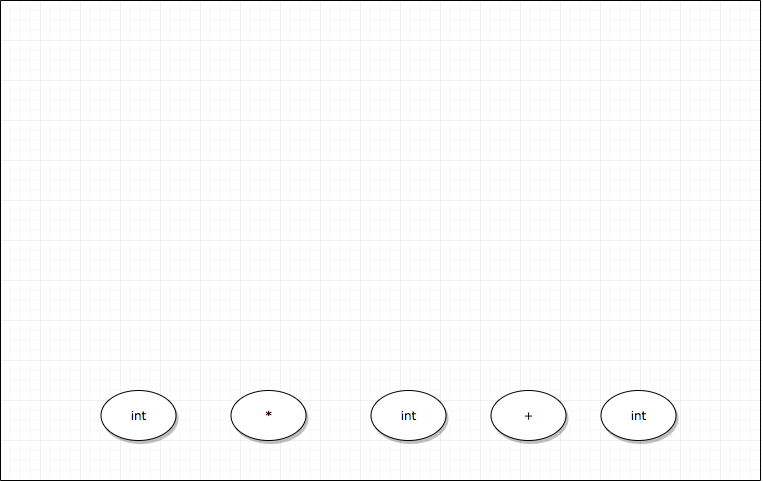
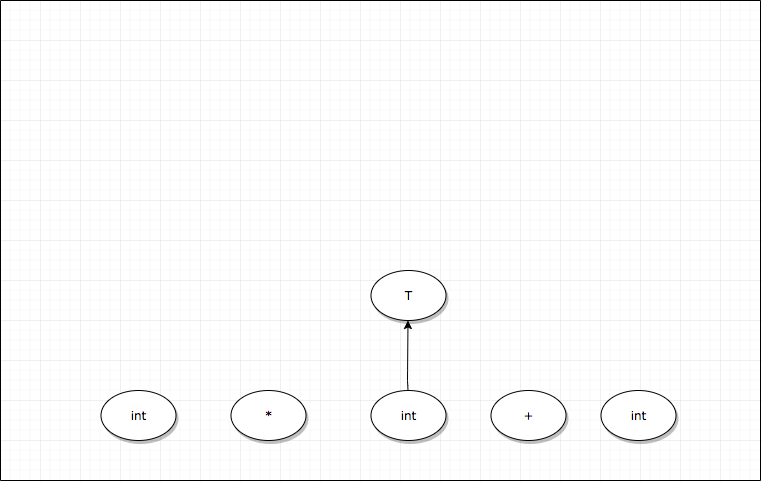
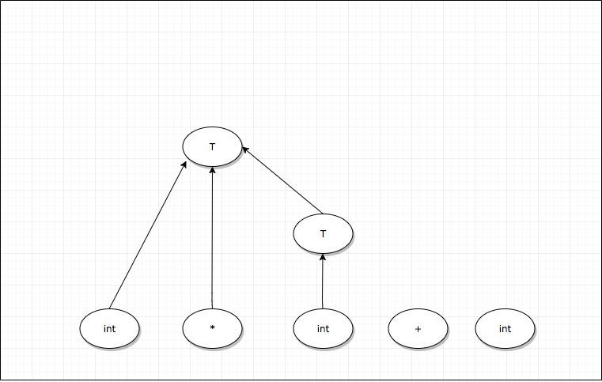
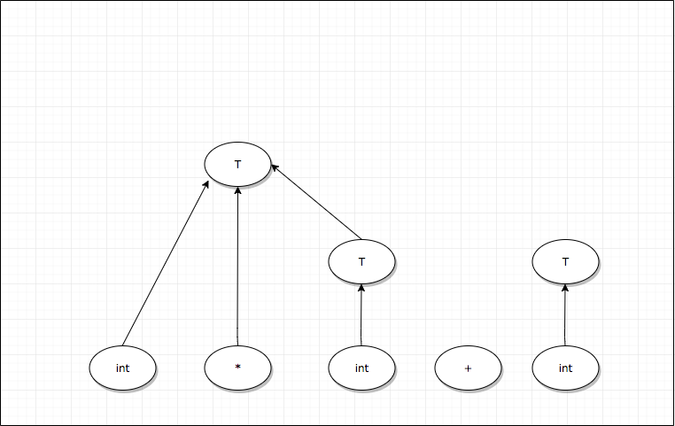
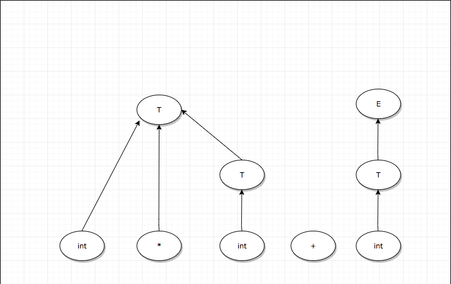
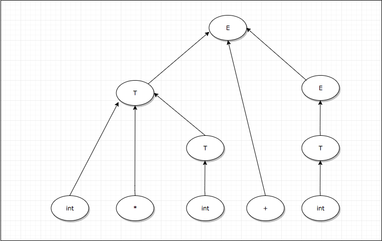

#Compilers

A compiler is a program that takes your code (like C or Go) and turns it into a file containing only 0's and 1's.  These 0's and 1's can then be run on a computer.  A compiler consists of 5 stages:  Lexing, Parsing, Semantic Analysis, Optimization, and Code Generation. 

What are interpreters?  How are they different from compilers?

An interpreter takes your code and just runs it without outputting a binary file.  It still does the same job of turning your code into 0's and 1's, however.  So running a binary file output from a compiler will be faster than running a source file through an interpreter.

However, that doesn't mean interpreters aren't still useful.  Look at this link to find out why:

https://www.quora.com/Why-do-we-use-interpreters-instead-of-using-compilers-for-everything-Is-platform-independence-the-main-reason

#Lexing

Imagine you wrote this program:

	while (true):
		print(i)
	
To a compiler, your program currently looks like an array of characters: 
	
	[ w, h, i, l, e, (, t, r, u, e, ), :, p, r, i, n, t, (, i, ) ]
	
As they are, the compiler has no idea what these characters mean.  The first part of the compiler is called the lexer.  It takes this stream of characters and turn it into a stream of tokens, like so:

	[ while, (, true, ), :, print, (, i, ) ]
	
A token is a blob of characters that has meaning in your programming language.  None of 'w', 'h', 'i', 'l', or 'e' have meaning individually, but 'while' does.  

All tokens have a value.  Most tokens values are identical to their names, like 'while', '(', and 'true'.  Other tokens, like strings, numbers, and variables have values different from their names.  Here's another example program:

	x=4;
	
and here is the token output when a lexer reads this program:

	[ ID='x', =, INT=4 ]
	
In practice, the token name ID usually denotes variable names, function names, and class names.

How do we know that 'while' is a WHILE token?  How does the lexer know not to output 5 ID tokens?

Lexers use the maximum munch rule.  The maximum munch rule means that the lexer will create the biggest tokens it possibly can.  So first it sees a 'w', and thinks "this could be an ID... I'll keep going".  Then it sees an h, an i, an l, an e, and a (.  Then it thinks "Ok, I know that 'while(' isn't a possible token, so the biggest token I can make is 'while'.

The lexer knows to make 'while' a WHILE token, and not an ID='while' token through precedence rules, which are hard-coded.  So when it sees a 'while', it thinks "this could be an ID, or it could be a WHILE token.  Since WHILE takes precedence over ID, I'll make this a WHILE".

 

Now, how do we actually code a lexer?  In other words, how do we create a program that will clump characters into tokens?  The answer is with regular expressions, or regex.  Regex describe patterns of characters using 3 operators:  Grouping, Boolean OR, and Quantification.

	Grouping:  r"ab" matches the string 'ab'
	Boolean OR:  r"a|b" matches the string 'a', or the string 'b'
	Quantification:  r"a*" matches the string '', the string 'a', the string 'aa', ... to infinity a's
	
You may have seen other regex operators in Java or Python, like + or ?.  These operators are just shortcuts of the 3 operators above.  `a+` is equivalent to `aa*` and `a?` is equivalent to `a|`.

We use regex to decide whether some string matches a pattern.  If we had a big file called X.txt, and we wanted to know if it contained only numbers, we could do it with regular expressions in python like this:

	import re
	
	regex01 = r"[0-9]+" 
	#shorthand for (0|1|2|3|4|5|6|7|8|9)(0|1|2|3|4|5|6|7|8|9)*.
	#There's two (0|1|2|3|4|5|6|7|8|9)'s because we want at least 1 digit.
	
	X = open('X.txt', 'r').read() 
	#The file X.txt has been read into the string X
	
	if re.match(regex01, X):
		print("Match")
	else:
		print("No match")
		
So if X.txt contained something like `98560134760976`, then "Match" would be printed out, but if it contained something like `3704974320ABC947523`, then "No match" would be printed out.  But rather than printing things out, a real lexer would call a function that would emit a token; something like `emitToken(tokenName, tokenValue)`.  For this example, rather than calling `print("Match")` we would call `emitToken(INT, 98560134760976 )`, which would emit an INT token object whose value was 98560134760976.
		

Can regular expressions match anything?

Regex can match a lot of patterns, but there are certain patterns it can't match that we need to make a real programming language.  Consider C, or Java.  These languages require parenthesis and curly braces to be balanced, which means for every '(' that opens up a new scope, there needs to be a ')' to close the scope.

Now see if you can think of a regular expression that can match '()', '(())', '((()))', '(((())))', etc, all the way up to an arbitrary number of parenthesis, _without_ matching anything unbalanced, like '(()', '(()))', etc.  Your first thought might be something like `(*)*`, but that would end up matching '(()' and '(()))'.  Next you might try something like `()|(())|((()))|(((())))|....` Which is a good effort.  You could make a regex expression that could match balanced parenthesis in the hundreds, thousands, millions, or beyond, but you can never create a regex expression that can match an arbitrary number of parenthesis.  But the parser will take care of that, so our lexer doesn't have to worry about it.

What about python?  It doesn't have parenthesis at all.

While python doesn't have parenthesis, it still uses 'balanced' whitespace in order to define scope, which ends up being the same problem.  

 

#Parsing

Look at this python program:

	y = f(4)                                      #line 1
	....                                          #line 2-199
	def f(x):                                     #line 200
		if x != 4:                                 #line 201
			print("that's not my favorite number") #line 202
			explode()                              #line 203
		else:                                     #line 204
			print("I cannot accept this gift")     #line 205
			return 4                               #line 206
	def explode():                                #line 207
		return 1 / 0                               #line 208
	
	
This program, like most, does not execute in order, e.g executing line 1, then line 2, then line 3, etc.  It starts at line 1, then jumps to line 200, then line 201, then line 204, 205, 206, then back to 1 before continuing.  

When our lexer turns the above program into a token stream, we get:

	[ ID=y, =, ID=f, (, INT=4, ), .... ]
	
The structure of this token stream is linear.  Line 1, line 2, line 3, etc.  It doesn't give us any information as to the order of program execution.

A parser turns a stream of tokens into a tree of tokens.  A tree's structure is non-linear; it can tell us more about the order in which a program will execute.

Even simple programs usually require some kind of tree structure.  Here is another example:

	2+3*2+3

and its token stream:

	[ INT=2, +, INT=3, *, INT=2, +, INT=3 ]
	
If our computer tried to execute this program token by token, these would be the steps it would take:

	2
	2+
	2+3
	5
	5*
	5*2
	10
	10+
	10+3
	13
	
Considering that 2+3*2+3=11, this is not the behavior that we want.  Computers are stupid.  They don't know that multiplication comes before addition.  If we instead take our token stream, and run it through a parser that understands our tokens, we would get an output like this:

Our computer will traverse this tree inorder.  In actual code, the parse tree would look like this:

	( +
		2
		( +
			( *
				3
				2
			)
		)
	)
	

Wait, this looks like Lisp/Scheme...

That's because it is, basically.  Putting the tree all on 1 line, you would get `(+ 2 (+ (* 3 2) 3 ) )`.  You could copy and paste this exact line into a lisp interpreter / compiler and it would run successfully.  

In Lisp, you are basically skipping lexing and parsing almost entirely by directly creating the parse tree.  Supposedly this makes Lisp more powerful.  By powerful I don't mean computationally powerful, as in it runs faster.  I mean linguistically powerful, as in you can express computational ideas in a much more concise manner than, say, C++, Java, or Python.  Of course, this is a very difficult thing to quantify, or prove, but there is a very devoted community of Lisp users that swear by its almighty power.

Another note is that since Lisp mostly skips lexing and parsing, it can be compiled faster than pretty much any other high-level language.  However, I can't remember where I found the benchmarks that prove it.

		
Notice now that the multiplication 3 * 2 will happen before the addition 2 + 3.  Now that the computer has explicit parenthesis to tell it the exact order of operations, the final answer will correctly come out to 11.

Once we have a parse tree for the input program, that program definitely has some semblance of sense.  It may still have errors in it, but the program is speaking a language that we understand.  Let's get a sense of where we are with some metaphorical compilations of English:

`asdfasfasdf`  This is complete gibberish, and means nothing.  Fails at the lexing stage.

`is was of I pancakes`  While each individual word (token) makes sense, they don't form a grammatically correct sentence.  Fails at the parsing stage.

`The goats mustache is Cameron Diaz`  Ok, we have a grammatically correct sentence, but we're missing something.  'The' goat?  What goat are we talking about?  Who is Cameron Diaz?  I don't know who they are, but I know a human can't be a goats mustache.  Fails at the semantic analysis stage.

`I must proceed at high velocity` Now we're getting somewhere.  Each token makes sense, and together they form a parse tree that tells us that 'I' absolutely need to move very fast.  This is a valid program, and should be able to run.  If the optimization or code generation stages fail, that's an error in the compiler, not an error in the users program.

So once we have created a parse tree for our input program, it is either a 'goats mustache' or a 'high velocity' program.

However, we still don't know how to create a parser.  To do that, we need to learn more about formal language theory.

`Formal Languages`  A formal language is the set of all possible sentences that follow some set of rules.  Validity is not disputed in formal languages.  Let's say you invent a language, and someone asks you 'Is this paragraph written in your language?'  If you can use the rules of your language to prove with 100% certainty that the paragraph is valid (it is written in your language) or invalid (it is not written in your language), then your language is a formal language.

Java and C are formal languages.  If you compile some text and the compiler throws an error, the text is not a valid program.  If the program compiles and runs, it is a valid program.

English is not a formal language.  English has rules, but there are definitely words and phrases that are arguably valid or invalid.

What if the program compiles, but has a runtime error?  Is the program valid?

Yes.  A runtime error, like a stack overflow, is a problem with the hardware of the machine.  If we had more memory, that error would not have occured.  So it's a problem with your language.

 

`Formal Grammar` formal grammars are the rules of formal languages.  The formal grammar rules in our parser are what turn the token stream into a token tree.  Parsers use a specific kind of formal grammar called a context-free grammar.

`Context-Free Grammar` CFGs are a subset of formal grammars.  Formal grammars use backus nar form to describe their rules.  

Example of a CFG in backus nar form:

	S -> x | xT
	T -> y | z
	
Formal grammars do the same thing that regular expressions do: they look through strings and return either true or false depending on whether the pattern matches or not.  They also construct a tree from the linear input they are given.

The above grammar will match the strings 'x', 'xy', and 'xz', and won't match anything else.
	
All formal grammars have:

A set of `terminal symbols`.  A terminal symbol is the smallest unit of meaning in a language.  Think of terminal symbols as single words.  The terminal symbols in our example are x, y, and z.  The terminal symbols in our compiler will be the tokens from our lexer. 

A set of `nonterminal symbols`.  A non-terminal symbol is a symbol that can be broken down into a combination of nonterminal and terminal symbols.  In our example, S and T are non-terminal symbols.  S can be broken down into either x, or xT.  T can be broken down into either y or z. 

A set of `production rules`.  Production rules tell you how to break down nonterminal symbols.  S->x is a production rule, S->xT is a production, T->y is a production, and T->z is a production.  S-> x | xT is not a production, it is 2 productions.

A `start symbol`.  A start symbol is just the nonterminal where you start parsing.  It's either denoted with S, Start, or it should be clear enough without explicit statement.

Here's another example:

	S -> (S) | epsilon
	
epsilon is a stand in for the empty string.  This grammar can match nested balanced parenthesis, which regex can't do.

Couldn't we do the S and T example with regex?

Yes.  A regular expression is actually a kind of formal grammar, and more, its a kind of context-free grammar.

All regex expressions have an equivalent backus-nar form.

Example regex:

	([A-Za-z])([A-Za-z0-9*])
	
Example equivalent backus-nar form:

	S -> Alpha T
	
	T -> Alpha T | Num T | epsilon
	
	Alpha -> A|a|B|b|C|c|D|d|E|e|F|f|G|g|H|h|I|i|J|j|K|k|L|l|M|m|N|n|O|o|P|p|Q|q|R|r|S|s|T|t|U|u|V|v|W|w|X|x|Y|y|Z|z
	
	Num -> 0|1|2|3|4|5|6|7|8|9
	
Our lexer is just a formal grammar.  It's terminals are individual characters, it's non-terminals are the tokens it outputs. Its start symbol is all of the tokens OR'd together, but we don't care about it.

Yeah, we could combine regex with backus nar form (thereby combining the lexer and the parser), but its better to keep them separate for a multitude of reasons.  Most of those reasons can be boiled down to 'it makes the implementation look ugly'.  There's also the fact that separating it into a lexer and parser lets us pipeline the two parts easily.  Also, it makes the whole 'parsing english' metaphor clearer, and therefore easier to understand conceptually.

So really the difference between regex and CFGs is that regex is just a special kind of CFG that is really easy to express, since we can use regular expressions instead of backus nar form.

`Shift Reduce Parsing`

There are a few techniques for parsing, but we're only going to learn about shift reduce parsing since that's the kind of parser that Bison generates.

SR parsers look through the tokens 1 at a time.  An SR parser keeps a stack of `items`.  Each item either a terminal (token) or non-terminal.  At each step of parsing, we do 1 of 2 things:  

1 We could take a token from the token stream and put it on our item stack.  This is called a `shift`.

2 We could use a production rule to combine multiple stack items into a single item.  This is a `reduce`.  Every time we reduce, we add a new node to our parse tree.

An SR parser shifts and reduces over and over until it can't shift or reduce anymore.  If there is no more input, and the only item on our stack is the start symbol, we have successfully created a parse tree.

Exactly how the SR parser decides whether to shift or reduce will remain mysterious for now.  Just know that sometimes the parser could either shift or reduce, and it always chooses the 'right' one to do.

Below is an SR parsing example.  In our example grammar, T and E are non-terminals, and int, *, and + are terminals (tokens).  Our example input to the parser is 'int * int + int'.  The vertical bar character | is used show where we are in our parse.  For instance, 'int * int | + int' means that our parser has looked at the 3 tokens 'int * int' and has put them on the item stack.  The parser has not yet looked at '+ int', and it has not yet reduced anything.  Whenever a shift move occurs, we put another token onto our stack, and move the | over by 1.  When we do a reduce move, some things to the left of the | will be changed, and we won't look at another token of input for that step.

	Production 1:  T -> int
	Production 2:  T -> int * T
	Production 3:  T -> (E)
	Production 4:  E -> T
	Production 5:  E -> T + E
	
<a class="prev" onclick="plusSlidesSLIDESHOWNAME(-1)">&#10094;</a>
<a class="next" onclick="plusSlidesSLIDESHOWNAME(1)">&#10095;</a>

  
1 / 11

  <pre>
  | int * int + int
  </pre>
  <pre>
  Parsing begins
  </pre>
  

  
2 / 11

  <pre>
  int | * int + int
  </pre>
  <pre>
  Shift
  </pre>
  

  
3 / 11

  <pre>
  int * | int + int
  </pre>
  <pre>
  Shift
  </pre>
  

  
4 / 11

  <pre>
  int * int | + int
  </pre>
  <pre>
  Shift
  </pre>
  

  
5 / 11

  <pre>
  int * T | + int
  </pre>
  <pre>
  Reduce by Production 1:  T -> int
  </pre>
  

  
6 / 11

  <pre>
  T | + int
  </pre>
  <pre>
  Reduce by Production 2:  T -> int * T
  </pre>
  

  
7 / 11

  <pre>
  T + | int
  </pre>
  <pre>
  Shift
  </pre>
  

  
8 / 11

  <pre>
  T + int |
  </pre>
  <pre>
  Shift
  </pre>
  

  
9 / 11

  <pre>
  T + T |
  </pre>
  <pre>
  Reduce by Production 1:  T -> int
  </pre>
  

  
10 / 11

  <pre>
  T + E |
  </pre>
  <pre>
  Reduce by Production 4:  E -> T
  </pre>
  

  
11 / 11

  <pre>
  E |
  </pre>
  <pre>
  Reduce by Production 5:  E -> T + E
  </pre>
  

Reductions seem backwards.  If Production 1:  T -> int has the arrow going from T to int, why are we turning ints into Ts?

To answer this question, I have to explain some history.  The first parsers did not use the shift reduce algorithm.  They instead used `recursive descent`.  Rather than taking tokens and combining them into non-terminals, they started at the start symbol non-terminal, and broke up the start symbol into its child terminals and non-terminals.  For example, it would start at E, and break that up into T using production 4.  Sometimes (most of the time) it would choose the wrong production.  So it would have to undo all of its work and break E up into T + E using production 5.

Since recursive descent parsers came first, backus nar form has the arrows going from non-terminals to the parts that you break it up into.

Recursive descent parsing is slow.  It can be sped up by using special kinds of CFGs, called LL(k) grammars.  If you use an LL(k) grammar, recursive descent is as fast as shift reduce.  However, LL(k) grammars are annoying to create.

Interestingly, GCC and Clang (the two most popular C/C++ compilers) both use hand-coded recursive descent compilers.  They don't use bison, and they don't use shift reduce.  Supposedly it's easier to maintain your code if you do everything by hand.  But there are other languages like Ruby that do use parser generators like Bison.  Right now, I would recommend using a parser generator like Bison.  It's much less work.  C/C++ have to use hand-written because they're bloated from years of committees of people piling on features that were always conflicting with eachother.  It's a giant mess. 

Why does the parse tree end with a bunch of non-terminal symbols on it?  I thought it was supposed to only have terminal symbols.

You are correct.  After we create the parse tree, we will remove all of the nonterminal symbols.  Exactly how we do this will come after we learn how the parser decides whether to shift or reduce. 

So how does the parser know which production to use?  Well, you know to use a production if that production can be traced back to the start symbol.

The whole parser is a giant graph of shifts/reduces that can be traced back to the start symbol.  Here's a parser that can parse our E, T grammar:

	insert graph here.  Will be part of that xml file 'ShiftReduceStepByStep'
	
Here's how the graph works:

Remember that our parser works in steps.  At each step, the parser decides whether to shift or reduce.  It decides by looking through the stack, bottom to top.  At each item in the stack, it makes a transition in the graph.

Before explaining each part of the graph, let's first go through an example.

Let's say we're parsing `int * int + int`, and the parse stack is `int * | int + int`, so 'int' and '*' are on the stack.  Now the parser decides what's next:  shift the next 'int', or reduce something on the stack?

The parser looks at its graph, always starting in the start state.  Then it looks at the bottom of the stack, sees an 'int', and travels to state 4.  Then it sees a '*' and travels to state 8.  Now that the parser has gone through the entire stack, the final state is 8, and the shift/reduce decision is based on state 8.

Each state has a bunch of `items` in it.  An item looks like a production with a . somewhere on its right hand side.  An item says 'This is a potential production that we could reduce by.  This dot tells us how much of the production we have seen so far.'  

So in the start state, the item S\` -> .E says:  We haven't seen anything yet, because there's nothing to the left of the '.'.  If the next item on the stack is an E, we can transform that E into an S\`.

An item says to shift if there's at least 1 thing to the right of its '.'.  If there is nothing to the right of the '.', then the item says to reduce.

If the parser ended in state 10, it would decide to shift.  If the parser ended in state 11, it would decide to reduce by the production `T->(E)`.

But most of these states have multiple items; how do we decide for those states?  First, notice that all the items are shift items for most of these states, like State 1, State 5, and State 6.  They all tell you to shift, and unlike reducing, there's only 1 way to shift an item.

However, there is a problem.  States 3 and 4 both have 1 shift item and 1 reduce item.  This is a `shift/reduce conflict`.  As our graph is now, the parser can't decide whether to shift or reduce.  We can alleviate this problem by using follow sets, which I don't feel like explaining properly.  Basically, we just peek at the next thing on the stack without putting it on the stack.  If the next thing in the input is a '+', we shift.  If it's not a '+', we reduce.  There are also `reduce/reduce conflicts` which are also solved with follow sets.

If doing the whole follow set thing doesn't work, then your grammar isn't `SLR`.

You really should have just explained top down parsing. It would have been much more natural.  You still haven't even explained ambiguity yet.

There's also another problem:  the runtime of this algorithm.  Our parser starts at the start state at every shift/reduce decision.  We can improve this by putting things on the stack along with the state that we finished on.  So instead of `int * | int + int`, we would have `(int 4) (* 8) | int + int`.  The things on the stack say 'we shifted an int because state 4 told us to, and * because state 8 told us to'.  Now at the next shift/reduce decision, our parser looks at the thing at the top of the stack, (* 8), and starts in state 8.

Here's how we actually made this graph:

	insert whole 'ShiftReduceStepByStep' xml file here.

You also need to explain how this gets turned into that really complicated table.

#Misc

http://trevorjim.com/python-is-not-context-free/

TODO

Figure out how to concisely explain epsilon, and where.  Probably in the lexer phase.

put your goats mustache example up at the very top.  Then at each stage, use that example to give them a sense of what this stage of the compiler does.  Also add these in:
optimization:  this stage is optional.  Makes code easier for computer to execute.  'I must proceed at high velocity' becomes 'Gotta go fast'.
code generation:  'Gotta go fast' becomes '010100100101001010010101001' (but make it accurate).  

Here are some things context free grammars can't do.  If a grammar is like this, it's context sensitive.
But we can just do some quick hacks like this and pretend that our grammar is still context free.
It's important to keep our grammars as close to context free as we can, since they can be parsed in O(n) time.  Context sensitive takes O(n^2) time.  So technically the grammars we make here take O(n^2) time, but just for a few operations, so in practice our parser and lexer will seem like it only takes O(n) time.

I feel like if you explain simply why LL(k) grammars don't matter, and more generally why you only ever need 1 token of lookahead, then all the rest of this stuff should fall into place.  Just simply explain why 1 token of lookahead should be all that is necessary.  Then, once you understand that only 1 token of lookahead is ever needed, explain why that's not entirely true, and that you USUALLY only ever need 1 token of lookahead.  GLR parsers USUALLY only look ahead 1 token.  And cut down on the definitions.
Once you compare all of these definitions and really hone in on what this stuff is, you should be able to figure out the perfect tools and implementation for your grammar.

Give a really quick overview of the parts of a compiler.  Lexer, parser, semantic analyzer, code generation.
Explain that assembly is binary.  Recall your 61C project where you made a processor that ran on binary.

explain regex and automata.  "in your head, you separate the tokens like this:  (for) (x) (in) ... but for all the computer knows the tokens should be separated like this: (f) (or x) (i)(n) ..."

Need good image manipulation software.  Much easier than the slideshow you made.

explain recursive descent

recursive descent algorithm limitation (logical or shortcircuitting)

left recursion

left factoring

first and follow sets

Consider trying to figure out some kind of step-by-step for certain things.  Like examples.  Consider the follow set example.

Oh, the first and follow set examples:  maybe give them the way to do it by hand?  No need to show them the computer code to do it.

Shift reduce parsing takes n time without needing to do all that grammar shifting around that recursive descent needs.  

https://stackoverflow.com/questions/3922699/what-is-the-runtime-difference-between-different-parsing-algorithms

Above link is interesting.  Very strange as well.  But ugh.  There's just so much.  I feel like conceptual simplicity matters the most.  Which means you should use a lexer and parser generator.  Bison uses shift reduce, so you should learn shift reduce.

Is there a specific name for the kinds of things a regular grammar can't accomplish?  Like it can't accomplish infinitely recursive structures, or it can't do infinite nesting, or it can't do uncountably infinite sets, or it can't do non-modulo sets, or something.  Just give a name to it.  As of now, it's hard to figure out whether you can write something as a regular expression or not.  You have to use the pumping lemma, I think.  Maybe explain that simply.  Would actually be useful.  'Can I write this as a regular expression'?  If yes, fantastic, an easy win.  If not, oh well, at least you didn't waste a bunch of time trying to think of a way to do it.

https://cs.stackexchange.com/questions/51189/ambiguity-vs-context-sensitivity
https://en.wikipedia.org/wiki/Ambiguous_grammar
https://stackoverflow.com/questions/14589346/is-c-context-free-or-context-sensitive

put the drop downs into > format.  Easier to keep it separate from the rest of the text.

Layers: copy the whole thing or just do it incrementally?
Definitely incrementally.  Imagine you had 1 node in layer 1.  Then you make 100 layers on top of it.  If you copy each layer, then change the position of node 1 in layer 100, none of the other layers get changed.  

