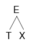
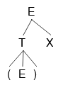
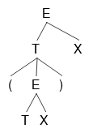
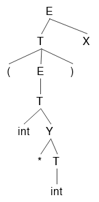
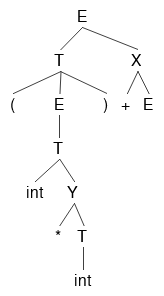
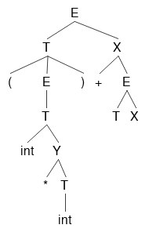
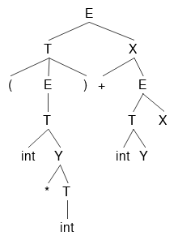
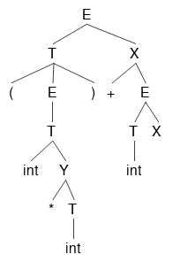
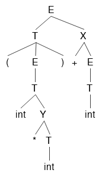

#Compilers

Notation

We'll start off with this example:

	E -> T | T + E
	T -> int | int * T | (E)

`grammar` the whole thing

`E, T` nonterminals

`int, *, (, )` terminals

`E -> T` the first production of E

`T -> int * T` the second production of T

`|` used to separate the productions of the nonterminals

`->` E can be converted to T

`->*` X can be converted to Y in ? steps

`stream` A list, file, array, etc.  Just any form of things one after the next.

DFA to Table Driven

Consider this regex of all binary strings that end in 1:

	(1|0)*1

Whose DFA implementation is as follows:	

We can convert this DFA into a table.  A table is easy to implement in code, as well as fast.  Here is a table equivalent to the DFA:

|  | `0` | `1` |
|-----|-----|-----|
| `S` | T | U |
| `T` | T | U |
| `U` | T | U |
 
 Say we have the input `0101`.  We are in state S, and the next input is 0, so we look at row S, column 0, whose entry is T.  This means we are now in state T.  
 
 The next input is 1, so we look in row T, column 1, whose entry is U.  Now we are in state U.  
 
 The next input is 0, so we look in row U, column 0, whose entry is T.  Now we are in state T.
 
 The next input is 1, so we look in row T, column 1, whose entry is U.  Now we are in state U.
 
 There is no more input, so we are done.  One thing that isn't in table that we need to somehow specify is that U is an accepting state, and S and T aren't.  Implemention is trivial and will be omitted :^)
 
 So in general, you have a current state, and you have a next token of input.  You do a table look up based on those 2 things to find your next state.  If at any point you try to do a table lookup and find nothing, that means the string does not match.  If we had the string `ab`, we would look in row S, and we wouldn't find a column corresponding to `a`, and our algorithm would return false, saying the string does not match our regular expression.

Parsing

A lexer turns a stream of characters into a stream of tokens.  A parser turns a stream of tokens into a tree of tokens.  We want to format our tokens into a tree so that we know the order of operations.

Example character stream:

`2+3*2+3`
	
Example token stream output from lexer:

`INT PLUS INT MUL INT PLUS INT`
	
Each INT has an actual numerical value that we don't see.

Example token tree output from parser:

Obviously we know the order of operations for the original character stream, but the computer doesn't.  If we told the computer to calculate the final result directly from the token stream, the output would be `(((2+3)*2)+3)=13` instead of the expected `2+(3*2)+3=11`.  This is why a parser is necessary.

Context Free Grammars

The regular grammars that we've looked at so far are a subset of Context Free Grammars.  So all regular grammars are context free grammars, 

Derivation

The term derivation refers to both the tree output of parsing, as well as the process of making the tree.

Recursive Descent

Recursive Descent is the simplest type of parsing algorithm.  The way recursive descent works is we get a big list (or stream) of tokens from the lexer.  We look at these tokens one at a time, forming them into a tree.

Example Grammar for recursive descent:

	E -> T | T + E
	T -> int | int * T | (E)
	
Recursive Descent Functions:

	bool Term(Token tok) { return *next++ == tok; }
	
	bool E() { 
		Token *save = next;
		
	
	bool E_1() { return T(); }
	bool E_2() { return T() && term('+') && E(); }
	
	bool T_1() { return term(INT); }
	bool T_2() { return term(INT) && term('*') && T(); }
	bool T_3() { return term('(') && E() && term(')'); }
	

	
Recursive descent limitations:
TODO

Predictive Parsing and LL(k) grammars

Predictive parsing is a confusing term.  Saying that you have a 'predictive parser' is not a statement about your parsing algorithm (recursive descent, shift reduce, etc).  Saying that you have a predictive parser means that the grammar your parser reads is an LL(k) grammar.  LL(k) grammars are a special kind of context-free grammars.  By looking at the next k tokens, we can narrow down the possible productions to 1 at every step.  This means there will never be any backtracking, making it faster.

Here is an example of a normal context-free grammar:

	A -> aaaa | aaab
	
Let's say we get the input `aaab`.  This grammar starts at the first production of A, matchs the first, second and third `a`, then hits `b` and has to backtrack.  Starting over at the first `a`, the parser matches the input with the second production, and we're done.

Here's an LL(k) grammar that parses the same language as above:

	A -> aaaX
	X -> a | b
	
In this grammar, k=1 because you only have to look at the next token to decide whether or not to keep parsing or error out.  For our input `aaab`, we match the first 3 `a`'s one at a time, then look at X.  `b` doesn't match X's first production, so we go to X's second production and get a match.  This is better than the first grammar because we only had to match `aaa` once.

So LL(k) grammars don't have to backtrack, unlike most context-free grammars.

Random facts:

All context-free grammars have an LL(k) equivalent.  Tools like ANTLR can transform context-free grammars into LL(k) grammars automatically.

In practice, we'll always be looking at LL(1) grammars. LL(k>1) grammars don't matter.  I think it's because if you can convert it to an LL(k) grammar, you can convert it to an LL(1) grammar.  LL(1) grammars are either faster, or simpler than any other value of k.  Something like that.

LL(k) vs regular grammars

Consider this grammar that parses nested parenthesis:

	E -> (E) | epsilon

Regular grammars can't describe nested parens.  So LL(k) grammars are more general that regular grammars.  

LL(k) grammars can be parsed in linear time just like regular grammars, unlike non-LL(k) context-free grammars.

The only advantage of regular grammars is that they can be described by regular expressions, and so are simpler to write out than context free grammars.

LL(1) Parsing tables

Remember how we converted DFA's into tables?  Tables are simple to implement in code, and fast to execute.  Now we want to make a parsing table for LL(1) grammars.

`Structure and usage of parsing table`

Lets say we have this grammar:

	E -> TX
	T -> (E) | int Y
	X -> +E | epsilon
	Y -> *T | epsilon

Its parsing table will look like this:

|   | `(` | `)` | `+` | `*` | `int` | `$` |
|---|-----|---------|---------|----|-------|---------|
| `E` | TX |  |  |  | TX |  |
| `T` | (E) |  |  |  | int Y |  |
| `X` |  | epsilon | +E |  |  | epsilon |
| `Y` |  | epsilon | epsilon | *T |  | epsilon |

Blanks in the table mean error.

We can create a parse tree using this table by starting at E, and looking at the first terminal in our input, we do a table lookup.  Whatever we find, we add to our tree with E as the root.  Since it's a leftmost derivation, we travel the branches in a pre-order fashion until we hit a leaf node that is a non-terminal.  Then we look at the next terminal, and do another table look up.

Input stream:

	(3 * 4) + 2

Derivation:

	E -> T X -> (E) X -> (T X) X -> (int Y X) X -> (int * T X) X -> (int * int Y X) X -> (int * int X) X 
	-> (int * int) X -> (int * int) + E -> (int * int) + T X -> (int * int) + int Y X -> (int * int) + int X
	-> (int * int) + int

These derivation steps are going to be gone through using the table.
TODO might want to put more captions on each of these steps so that people get a better idea of how it corresponds to the table.

Step-by-step derivation

<a class="prev" onclick="plusSlides2(-1)">&#10094;</a>
<a class="next" onclick="plusSlides2(1)">&#10095;</a>

1 / 14

<pre>
(3*4)+2
&#8593;
</pre>

2 / 14

<pre>
(3*4)+2
&#8593;
</pre>

3 / 14

<pre>
(3*4)+2
 &#8593;
</pre>

Now that we've derived the '(', we can move on to the second token of input, '3'.

4 / 14

<pre>
(3*4)+2
 &#8593;
</pre>

5 / 14

<pre>
(3*4)+2
  &#8593;
</pre>

6 / 14

<pre>
(3*4)+2
   &#8593;
</pre>

7 / 14

<pre>
(3*4)+2
    &#8593;
</pre>

8 / 14

<pre>
(3*4)+2
    &#8593;
</pre>

Since the row 'Y', column ')' entry is 'epsilon', Y is nothing, and we do not need to represent it anymore.

9 / 14

<pre>
(3*4)+2
     &#8593;
</pre>

After we delete the X that turned out to be an epsilon, we hit the ')', and consume it.  Only writing this because it may not be immediately clear.

10 / 14

<pre>
(3*4)+2
     &#8593;
</pre>

11 / 14

<pre>
(3*4)+2
     &#8593;
</pre>

12 / 14

<pre>
(3*4)+2
      &#8593;
</pre>

13 / 14

<pre>
(3*4)+2
      &#8593;
</pre>

14 / 14

<pre>
(3*4)+2
      &#8593;
</pre>

Here is our finished parse tree.  We can turn it into an AST by getting rid of all the non-terminals, which I don't feel like doing.

`How parsing tables are constructed`

Looking at our parsing table again, we know that if our current non-terminal is 'T', and our current terminal is '(', we should choose the production '(E)', and if an 'int' is our terminal, we should choose the production 'int Y'.  What we don't know is how to make a parsing table like this.  How should we know to assign T['T', '('] -> '(E)' in the first place?  Now we will show you.

In the DFA table, we had a current state, and a next token which would determine our next table lookup.  In our LL(1) table, we have a current non-terminal instead of a current state.  Each table lookup has this form:

	T[A, t] = X
	
TODO how is the parsing table really created?  What 2 things do we have, what 3rd thing are we looking for?  Iterate over each position in the table?  Iterate over all possible terminals?  And why can we have 2 things (like a TX) in the parsing table?

So we have our parsing table with non-terminals as rows and terminals as columns, and nothing in the entries.  For each non-terminal, we iterate over its productions.  For each production, we calculate that productions first set using the first and follow sets of each thing it contins.  Then we look at that productions first set.  For each terminal in the productions first set, we put that production in at the entry (non-terminal, terminal).

First Sets

`T[A, t] = B` if t is in the first set of B.  
The first set of a non-terminal B is the set of all terminals that appear first in B's derivation.

	A -> Bx | Cy
	B -> 0 | 1
	C -> a | epsilon
	
In this grammar, the first sets of A, B and C are:

	A : { 0, 1, a, y }
	B : { 0, 1 }
	C : { a, epsilon }
	
B and C are trivial, so I'll skip those.  A's first set looks like it does because when A is derived all the way down to terminals, it could look like any of the following:

	0x
	1x
	ay
	y
	
Since we want the first terminal that can be derived from A, we end up with 0, 1, a, and y.

So if we're at A, we will transition to B if `t=0` or `t=1`.
TODO I this is wrong.  What happens after we get to B?  We just die.

In general, finding the first sets for each terminal and non-terminal in a grammar is as follows:

	t : { t } // if t is a terminal symbol
	First(Y) is a subset of First(X) if X -> Y....
		or X -> ABCY....
			and A, B, C can all be epsilon.
	epsilon is an element of First(X) if:
		X -> epsilon
		or
		X -> ABC
			and A, B, C can all become epsilon

Follow Sets

Here's the definition of a follow set for non-terminal X:

	Follow(X) = { t | Y ->* AXtB }
	
What this says is that t is in Follow(X) if Y's multiple-step derivation contains X, and also has some terminal t after it.  

The start symbol S's follow set will contain only `$` (end of file).

<a class="prev" onclick="plusSlides1(-1)">&#10094;</a>
<a class="next" onclick="plusSlides1(1)">&#10095;</a>

Step 1 / 14:  Start at E
<pre>
Follow(E) = { $ }
Follow(T) = { }
Follow(X) = { }
Follow(Y) = { }
Follow('(') = { }
Follow(')') = { }
Follow('+') = { }
Follow('*') = { }
Follow(int) = { }
</pre>

Step 2 / 14:  Look at E -> TX
<pre>
Follow(E) = { $ }
Follow(T) = { First(X) }
Follow(X) = { Follow(E) }
Follow(Y) = { }
Follow('(') = { }
Follow(')') = { }
Follow('+') = { }
Follow('*') = { }
Follow(int) = { }
</pre>

Step 3 / 14:  Look at T -> (E)
<pre>
Follow(E) = { $, ')' }
Follow(T) = { First(X) }
Follow(X) = { Follow(E) }
Follow(Y) = { }
Follow('(') = { First(E) }
Follow(')') = { Follow(T) }
Follow('+') = { }
Follow('*') = { }
Follow(int) = { }
</pre>

Step 4 / 14:  Look at T -> int Y
<pre>
Follow(E) = { $, ')' }
Follow(T) = { First(X) }
Follow(X) = { Follow(E) }
Follow(Y) = { Follow(T) }
Follow('(') = { First(E) }
Follow(')') = { Follow(T) }
Follow('+') = { }
Follow('*') = { }
Follow(int) = { First(Y) }
</pre>

	

Step 5 / 14:  Look at X -> +E
<pre>
Follow(E) = { $, ')', Follow(X) }
Follow(T) = { First(X) }
Follow(X) = { Follow(E) }
Follow(Y) = { Follow(T) }
Follow('(') = { First(E) }
Follow(')') = { Follow(T) }
Follow('+') = { First(E) }
Follow('*') = { }
Follow(int) = { First(Y) }
</pre>

Step 6 / 14:  Look at X -> epsilon
<pre>
Follow(E) = { $, ')', Follow(X) }
Follow(T) = { First(X) }
Follow(X) = { Follow(E) }
Follow(Y) = { Follow(T) }
Follow('(') = { First(E) }
Follow(')') = { Follow(T) }
Follow('+') = { First(E) }
Follow('*') = { }
Follow(int) = { First(Y) }
</pre>

Step 7 / 14:  Look at Y -> * T
<pre>
Follow(E) = { $, ')', Follow(X) }
Follow(T) = { First(X), Follow(Y) }
Follow(X) = { Follow(E) }
Follow(Y) = { Follow(T) }
Follow('(') = { First(E) }
Follow(')') = { Follow(T) }
Follow('+') = { First(E) }
Follow('*') = { First(T) }
Follow(int) = { First(Y) }
</pre>

Step 8 / 14:  Look at Y -> epsilon
<pre>
Follow(E) = { $, ')', Follow(X) }
Follow(T) = { First(X), Follow(Y) }
Follow(X) = { Follow(E) }
Follow(Y) = { Follow(T) }
Follow('(') = { First(E) }
Follow(')') = { Follow(T) }
Follow('+') = { First(E) }
Follow('*') = { First(T) }
Follow(int) = { First(Y) }
</pre>

TODO algorithm for computing follow sets
 
You should just ignore this part for now.  It's not necessary to know how to make these first and follow sets.  Just know how to recognize them.  It's a complicated exponential runtime algorithm.
Here is the general algorithm for getting follow sets, which we run on each production: 

	for each  nonterminal on the right side of X -> ABC....Z:
		Follow(A) += First(B)
		if epsilon in First(B)
			Follow(A) += First(C)
			if epsilon in First(C)
				....
				if epsilon in First(Z)
					Follow(A) += Follow(X)
					
		Follow(B) += First(C)
		if epsilon in First(C)
				....
				if epsilon in First(Z)
					Follow(B) += Follow(X)
					
		Do this for all of them
		TODO should make a recursive version of this.  Also should have a portion that takes into account whether First(B) is already in Follow(A), etc.
		

Now we'll compute follow sets for this grammar, where E is the start symbol:

	E -> TX
	T -> (E) | int Y
	X -> +E | epsilon
	Y -> *T | epsilon

computing follow sets example

In this example, keep in mind the first sets from the previous example.

This is really long, so I'm not going to finish it.  It would have been nice to have the ability to do slideshows.  Stupid markdown.

	

building the parsing table after you have first and follow sets

TODO potentially put the first follow algorithms + examples here instead.
TODO look at video LL1 parsing tables again.  The `T[A, t] = B` thing. How do you know what the next A is?  It's actually the leftmost nonterminal in your current derivation.  Going to have to go back and change that.  If the leftmost thing is a terminal, then `T['int', t]` is a pointless lookup, since you can just do a direct comparison:  `'int' == t`.  For simplicity you could do a table lookup, or maybe this is faster.  Whatever.  Just do what you think would be easier to explain.

Now that we have the first and follow sets for each terminal and non-terminal, we can find all the t's for each `T[A, t] = B`.  

	for all non-terminal combos A and B in your language:
		for each t in First(B):
			T[A, t] = B
		if epsilon in First(B):
			for each t in Follow(A):
				T[A, t] = B

TODO

Give a really quick overview of the parts of a compiler.  Lexer, parser, semantic analyzer, code generation.
Explain that assembly is binary.  Recall your 61C project where you made a processor that ran on binary.

explain regex and automata.  "in your head, you separate the tokens like this:  (for) (x) (in) ... but for all the computer knows the tokens should be separated like this: (f) (or x) (i)(n) ..."

Need good image manipulation software.  Much easier than the slideshow you made.

explain terminology better.

explain recursive descent

recursive descent algorithm limitation ( logical or shortcircuitting)

left recursion

left factoring

first and follow sets

Consider trying to figure out some kind of step-by-step for certain things.  Like examples.  Consider the follow set example.

Oh, the first and follow set examples:  maybe give them the way to do it by hand?  No need to show them the computer code to do it.

`Bottom Up Parsing`

Rather than starting at the start symbol and eventually deriving the terminals, we start at the list of terminals and condense them into the start symbol.  Bottom Up parsing is just as fast as LL(1) parsing, and also doesn't require a left-factored grammar.

Imagine when you built the parse tree for top down parsing.  You started at the root note, and expanded it out over and over until you got to the leaves, leftmost first.  With bottom up parsing, instead imagine all of the leaves, unconnected.  Then connect them together, starting at the leftmost leaves, and doing this until you have created a root node and everything is connected to it.  Hit rewind and you get a rightmost derivation.  Well, not exactly rewind.  You're not erasing connections between nodes.  The reverse rightmost derivation analogy isn't that important, I don't think.

Actually, when you imagine the string of terminals, start connecting them / reducing them downward.  Don't build up.  Then maybe the analogy will be more clear.

`Shift Reduce Parsing`

A kind of bottom up parsing.  Say that `aBw` is what we currently have in our parse.  Now assume `X->B` is the next step.  Remember that this means we will replace `aBw` with `aXw`, since it's a bottom up parse and we're going in the reverse direction we normally would.  Anyway, assuming `X->B` is next, then we know `w` must be a string of terminals, with no non-terminals in it.  This is because we're going left to right.  If someting is on the right of what we are currently working on, we haven't touched it yet.  So we haven't touched any of `w` yet, which means it's a bunch of terminals.

So knowing that everything to the right of our rightmost non-terminal is a bunch of terminals, we are going to separate our string thing into 2 parts with a |, like so:  `aX|w`.  Everything to the left we have seen so far, and is composed of terminals and non-terminals, and everything to the right we have not seen yet, and is composed only of terminals.  

Shift reduce parsing gets its name because it only has 2 possible actions:  shifting and reducing.  We've already seen reduce moves:

	aB|w -> aX|w
	
We haven't seen shift moves yet.  A shift move is simply reading the next 1 token of input:

	aX|w -> aXw|
	
Note that in this example, w is a single terminal, though in previous examples it was multiple terminals.

	E -> T + E | T
	T -> int * T | int | (E)

example:
	
	|int*int+int
	int|*int+int
	T|*int+int //MISTAKE
	
You shouldn't reduce to T because `T * int` doesn't exist in this grammar, meaning that if you make that last reduction, you'll never get back to the start symbol.  If instead you did:

	|int*int+int
	int|*int+int
	int*|int+int
	int*int|+int
	int*T|+int
	
That would be fine, because `int*T` is in the grammar, and can be further reduced.  So just because you _can_ make a reduction doesn't mean you _should_.  But how do you know when to reduce and when to shift?

When you reduce, that's when you put stuff together in your tree.  When you shift, you add a new token to the bottom of the tree.

What about the first 2 productions of T?  If those are both in a dfa state, and you transition and consume an int, what goes on the stack?  Is that a shift reduce conflict?  Yes, it is.  This is when you look in the follow of T.  If the next thing is in the follow of T, put the reduce on the stack.  If the next thing is the first thing to the right of your . in the item, put the shift on the stack.  

`Handles`
A handle is a prefix of a string that is safe to reduce.  So in the previous example, we encounter our first handle at `int*int|+int`, where the second `int` is the handle.  

`Recognizing handles`
On most CFG's, there's no efficient algorithm for recognization.  However, just like with predictive parsing, there are certain subsets of CFG's that make it simple.

A viable prefix is on the left of a |.  
A viable prefix is a prefix of THE handle.(?)  
If there's at least 1 viable prefix, there's no parsing error.
Just a name, not super deep.

Important:  the set of viable prefixes is a regular language.

insert circle graph thing here with LR grammars. 

Handle
Prefix (is he actually talking about viable prefixes?)
viable prefix
item
stack of prefixes

algorithm is stack nfa, nfa->dfa, dfa is table driven.  We leave it as an nfa because it's simpler to write.
Uses items for each state, I think.  The stack is a sequence of partial right-hand sides.

Maybe explicitly say that you're going to skip all the weird definitions and just show the algorithm.

For the NFA, notice there are states

	E->.T
	E->.T+E
	
Both of these are allowed, since we are in an NFA.  We simply say that we are in both states until proven otherwise.  If you wanted a DFA, you would do what you did before:  combine the common parts into 1 element.

But wait, how are we doing this using NFA's?  I thought only regular expressions could be NFA's?  Need to explain the prefix thing.  How does that work?  We MUST be leaving something out.  Try the nested parens example again.  Hm...the nfa is based on the stack, and the stack is implemented through your CFG.  So it's not your grammar that's being translated into an NFA, it's the grammar tree thing, I think.

NFA starts at the start symbol, then you immediately slide down all the epsilon moves, and you're in all the states that don't have any epsilon transitions out.  These states will be states like `T -> (E)` that have a terminal as the first thing in their production.

DFA example just shoves all the NFA states into 1 thing.  This isn't how you actually do it, since if you want to know if you have to shift / reduce, you have to look at every item contained in that state, which isn't actually O(n).  You would have to separate all of these states by left-factoring.  It's just not done for simplicity.

reduce/reduce conflict if a state has 2 reduce items

shift/reduce if any state has a reduce and a shift item

there is no such thing as a shift/shift conflict.  If more than 1 can shift, you can just do it.  No need to choose, since they're all shifting by the same terminal.

shift items look like:  `X->B.`, `Y->w.`
reduce items look like: `Y->w.tf`
Shift items all have the . at the end because you are done with the production and so should shift in a terminal from the unseen part.

Note that shift/reduce conflicts don't require that you change your grammar or whatever.  You could always just split it into 2 threads, and which ever one lives, wins.

Note that could be important:  while this shift reduce stuff is kind of annoying, the whole shift/reduce and reduce/reduce conflicts may actually be useful to know.  After all, a GLR parser will stil have conflicts, and will probably report them.  Fixing these conflicts will result in faster parsing.

SLR parsing
Add 1 new rule:  Reduce by X->B if t in Follow(X).  This is in addition to the other rules.
'If there are conflicts under these rules, the grammar is not SLR'.
I think this solves shift reduce conflicts?  Maybe?

Previously, you run the DFA on the entire stack over and over.  Faster to not do that.  Remember that the stack is full of prefixes?  Now it's full of prefixes, and each of those prefixes has an accompanying DFA state.  Now you can easily get back to where you were, and don't have to start the DFA over from the beginning.

now you have 2 parsing tables:  goto, which tells you the next dfa state to go to , and action, which tells you what to do on your stack, shift, reduce, error, accept.

How to do the algorithm with the NFA / DFA.  How it corresponds with the tables / with the parse tree.  Use the chart to explain that you're going to ignore a lot of bottom up parsing stuff.  Forget handles, valid items, etc.  Explain how you make the table.

***
Just do the algorithm now, and annotate as you go along

transitions are made based on the top of the stack.  Since the stack can have both terminals and non-terminals, that's how we get a dfa.

The upcoming terminal is to determine whether to shift or to reduce.  It is also used to determine what transition to take if you are reducing (in other words, if you need to know what is in the follow of the top of your stack).

goto[i, A] = j if state i ->(A) state j.
If you're in state i, and A is the symbol on top of the stack, go to state j.  This is our DFA table.

