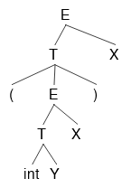
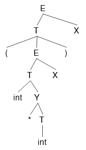

#Compilers

A compiler is a program that takes your code (like C or Go) and turns it into a file containing only 0's and 1's.  These 0's and 1's can then be run on a computer.  A compiler consists of 5 stages:  Lexing, Parsing, Semantic Analysis, Optimization, and Code Generation. 

What are interpreters?  How are they different from compilers?

An interpreter takes your code and just runs it without outputting a binary file.  It still does the same job of turning your code into 0's and 1's, however.  So running a binary file output from a compiler will be faster than running a source file through an interpreter.

However, that doesn't mean interpreters aren't still useful.  Look at this link to find out why:

https://www.quora.com/Why-do-we-use-interpreters-instead-of-using-compilers-for-everything-Is-platform-independence-the-main-reason

#Lexing

Imagine you wrote this program:

	while (true):
		print(i)
	
To a compiler, your program currently looks like an array of characters: 
	
	[ w, h, i, l, e, (, t, r, u, e, ), :, p, r, i, n, t, (, i, ) ]
	
As they are, the compiler has no idea what these characters mean.  The first part of the compiler is called the lexer.  It takes this stream of characters and turn it into a stream of tokens, like so:

	[ while, (, true, ), :, print, (, i, ) ]
	
A token is a blob of characters that has meaning in your programming language.  None of 'w', 'h', 'i', 'l', or 'e' have meaning individually, but 'while' does.  

All tokens have a value.  Most tokens values are identical to their names, like 'while', '(', and 'true'.  Other tokens, like strings, numbers, and variables have values different from their names.  Here's another example program:

	x=4;
	
and here is the token output when a lexer reads this program:

	[ ID='x', =, INT=4 ]
	
In practice, the token name ID usually denotes variable names, function names, and class names.

How do we know that 'while' is a WHILE token?  How does the lexer know not to output 5 ID tokens?

Lexers use the maximum munch rule.  The maximum munch rule means that the lexer will create the biggest tokens it possibly can.  So first it sees a 'w', and thinks "this could be an ID... I'll keep going".  Then it sees an h, an i, an l, an e, and a (.  Then it thinks "Ok, I know that 'while(' isn't a possible token, so the biggest token I can make is 'while'.

The lexer knows to make 'while' a WHILE token, and not an ID='while' token through precedence rules, which are hard-coded.  So when it sees a 'while', it thinks "this could be an ID, or it could be a WHILE token.  Since WHILE takes precedence over ID, I'll make this a WHILE".

 

Now, how do we actually code a lexer?  In other words, how do we create a program that will clump characters into tokens?  The answer is with regular expressions, or regex.  Regex describe patterns of characters using 3 operators:  Grouping, Boolean OR, and Quantification.

	Grouping:  r"ab" matches the string 'ab'
	Boolean OR:  r"a|b" matches the string 'a', or the string 'b'
	Quantification:  r"a*" matches the string '', the string 'a', the string 'aa', ... to infinity a's
	
You may have seen other regex operators in Java or Python, like + or ?.  These operators are just shortcuts of the 3 operators above.  `a+` is equivalent to `aa*` and `a?` is equivalent to `a|`.

We use regex to decide whether some string matches a pattern.  If we had a big file called X.txt, and we wanted to know if it contained only numbers, we could do it with regular expressions in python like this:

	import re
	
	regex01 = r"[0-9]+" #shorthand for (0|1|2|3|4|5|6|7|8|9)(0|1|2|3|4|5|6|7|8|9)*.
	                    #There's two (0|1|2|3|4|5|6|7|8|9)'s because we want at least 1 digit.
	
	X = open('X.txt', 'r').read() #The file X.txt has been read into the string X
	
	if re.match(regex01, X):
		print("Match")
	else:
		print("No match")
		
So if X.txt contained something like `98560134760976`, then "Match" would be printed out, but if it contained something like `3704974320ABC947523`, then "No match" would be printed out.  But rather than printing things out, a real lexer would call a function that would emit a token; something like `emitToken(tokenName, tokenValue)`.  For this example, rather than calling `print("Match")` we would call `emitToken(INT, 98560134760976 )`, which would emit an INT token object whose value was 98560134760976.
		

Can regular expressions match anything?

Regex can match a lot of patterns, but there are certain patterns it can't match that we need to make a real programming language.  Consider C, or Java.  These languages require parenthesis and curly braces to be balanced, which means for every '(' that opens up a new scope, there needs to be a ')' to close the scope.

Now see if you can think of a regular expression that can match '()', '(())', '((()))', '(((())))', etc, all the way up to an arbitrary number of parenthesis, _without_ matching anything unbalanced, like '(()', '(()))', etc.  Your first thought might be something like `(*)*`, but that would end up matching '(()' and '(()))'.  Next you might try something like `()|(())|((()))|(((())))|....` Which is a good effort.  You could make a regex expression that could match balanced parenthesis in the hundreds, thousands, millions, or beyond, but you can never create a regex expression that can match an arbitrary number of parenthesis.  But the parser will take care of that, so our lexer doesn't have to worry about it.

What about python?  It doesn't have parenthesis at all.

While python doesn't have parenthesis, it still uses 'balanced' whitespace in order to define scope, which ends up being the same problem.  

 

Now that we've turned a stream of meaningless characters into meaningful tokens, we now need to figure out how those tokens interact with eachother.

#Parsing

Look at this python program:

	y = f(4)                                      #line 1
	....                                          #line 2-199
	def f(x):                                     #line 200
		if x != 4:                                 #line 201
			print("that's not my favorite number") #line 202
			explode()                              #line 203
		else:                                     #line 204
			print("I cannot accept this gift")     #line 205
			return 4                               #line 206
	def explode():                                #line 207
		return 1 / 0                               #line 208
	
	
This program, like most, does not execute in order, e.g executing line 1, then line 2, then line 3, etc.  It starts at line 1, then jumps to line 200, then line 201, then line 204, 205, 206, then back to 1 before continuing.  

When our lexer turns the above program into a token stream, we get:

	[ ID=y, =, ID=f, (, INT=4, ), .... ]
	
The structure of this token stream is linear.  Line 1, line 2, line 3, etc.  It doesn't give us any information on how to actually execute the program.

A parser turns a stream of tokens into a tree of tokens.  A tree's structure is non-linear; it can tell us more about the order in which a program will execute.

Even simple programs usually require some kind of tree structure.  Here is another example:

	2+3*2+3

and its token stream:

	[ INT=2, +, INT=3, *, INT=2, +, INT=3 ]
	
If our computer tried to execute this program token by token, these would be the steps it would take:

	2
	2+
	2+3
	5
	5*
	5*2
	10
	10+
	10+3
	13
	
Considering that 2+3*2+3=11, this is not the behavior that we want.  Computers are stupid.  They don't know that multiplication comes before addition.  If we instead take our token stream, and run it through a parser that understands our tokens, we would get an output like this:

Our computer will traverse this tree inorder.  In actual code, the parse tree would look like this:

	( +
		2
		( +
			( *
				3
				2
			)
		)
	)
	

Wait, this looks like Lisp/Scheme...

That's because it is, basically.  Putting the tree all on 1 line, you would get `(+ 2 (+ (* 3 2) 3 ) )`.  You could copy and paste this exact line into a lisp interpreter / compiler and it would run successfully.  

In Lisp, you are basically skipping lexing and parsing almost entirely by directly creating the parse tree.  Supposedly this makes Lisp more powerful.  By powerful I don't mean computationally powerful, as in it runs faster.  I mean linguistically powerful, as in you can express computational ideas in a much more concise manner than, say, C++, Java, or Python.  Of course, this is a very difficult thing to quantify, or prove, but there is a very devoted community of Lisp users that swear by its almighty power.

Another note is that since Lisp mostly skips lexing and parsing, it can be compiled faster than pretty much any other high-level language.  However, I can't remember where I found the benchmarks that prove it.

		
Notice now that the multiplication 3 * 2 will happen before the addition 2 + 3, which is what we want.  

Once we have a parse tree for the input program, that program definitely has some semblance of sense.  It may still have errors in it, but the program is speaking a language that we understand.  Let's get a sense of where we are with some metaphorical compilations of English:

`asdfasfasdf`  This is complete gibberish, and means nothing.  Fails at the lexing stage.

`is was of I pancakes`  While each individual word (token) makes sense, they don't form a grammatically correct sentence.  Fails at the parsing stage.

`The goats mustache is Cameron Diaz`  Ok, we have a grammatically correct sentence, but we're missing something.  'The' goat?  What goat are we talking about?  Who is Cameron Diaz?  I don't know who they are, but I know a human can't be a goats mustache.  Fails at the semantic analysis stage.

`I must proceed at high velocity` Now we're getting somewhere.  Each token makes sense, and together they form a parse tree that tells us that 'I' absolutely need to move very fast.  This is a valid program, and should be able to run.  If the optimization or code generation stages fail, that's an error in the compiler, not an error in the users program.

So once we have created a parse tree for our input program, it is either a 'goats mustache' or a 'high velocity' program.

However, we still don't know how to create a parser.  To do that, we need to learn more about formal language theory.

`Formal Languages` A formal language is a language where validity is not disputed.  

English, is not a formal language.  Recently, the term 'neckbeard' was put into the Oxford dictionary.  However, that doesn't mean every English speaker now agrees that 'neckbeard' is an actual word.  If someone were to tell me 'You are a neckbeard', I would mock them for not speaking valid english, and they would probably retort that it was valid, and I'm just dumb for not understanding.  

Programming languages like C and Java are formal languages.  If you compile a program and it works, no one can say 'that's not a valid program'.  If you compile a program and it throws an error, then your program is invalid, end of discussion.

The actual definition of a formal language is the set of all strings created by its `alphabet`.  An alphabet is all the characters in your language.  The definition of alphabet here is a little different than the definition we're used to.  In english, the 'alphabet' that we're used to is a to z, upper and lower case.  But the actual, formal English alphabet also includes punction like commas, semicolons, periods, question marks, etc.  I would also throw in the digits 0-9, maybe the dollar and pound signs, and whatever else you might read in a book written in english.

So if a formal language is the set of all strings created by its alphabet, then it's an infinite set.  Even if your alphabet was just 'a', your formal language would be a, aa, aaa, aaaa, .... etc.  So really the only way we can show someone a formal language is to say 'here's the alphabet, do whatever you want with it.'

So the sentence 'asdfoiasfiashfoaifijds' is actually in the english language.  However, it is not a grammatically correct sentence, which brings us to formal grammars.

`Formal Grammar` A formal grammar is how we describe the rules of a formal language.  Regular expressions are a kind of formal grammar.

alphabet.

Meaning function.  Maps syntax to semantics.  So it maps the syntax '[0-9]+' to the semantics INT.  Syntax is the word, semantics is its meaning.  In this example, INT isn't really the semantics, it's actually shorthand for the real semantics.  The real semantics is that it's a number, which means you can do all the number-y stuff you could possibly think of to this piece of syntax.  So INT is also syntax.  It stands in for the meaning  I can't actually show you all the semantics.  Or maybe just start off by saying INT is the syntax, and going straight into saying the semantics are math stuff.  Meaning is many to 1.  It takes an infinite set of possible strings of digits, and tells you they all have the same meaning:  they are numbers.  Think of the infinite set of strings of digits.  You can't go through them 1 by 1 and explain their meaning to someone.  You have to say 'if a string follows this pattern, it means this'.  

bla bla bla

then explain them all together.  Make sure to explain that a language is the set of all sentences generated by the grammar.  So it's a really really big infinite set.

***

The regular expressions we used during lexing are a kind of regular grammar, which is a kind of formal grammar.

A formal grammar specifys a formal language.  It is composed of G(Sigma, thing, thing thing).  These together make up a formal grammar.

To create a parser, we need to create a context-free grammar, which is more expressive than regular grammars.  Unlike regular grammars, we can't use regular expressions to create a context-free grammar.  Instead, context-free grammars are usually described using backus nar form.

Here's an example of backus nar form.

Side note, regular grammars are special because unlike context-free, they can be expressed using regular expressions instead of backus nar form.  You could create a regular grammar using backus nar form, but since regular expressions are easier, we use them instead.

syntax
semantics
language
grammar

Here are some things context free grammars can't do.  If a grammar is like this, it's context sensitive.
But we can just do some quick hacks like this and pretend that our grammar is still context free.
It's important to keep our grammars as close to context free as we can, since they can be parsed in O(n) time.  Context sensitive takes O(n^2) time.  So technically the grammars we make here take O(n^2) time, but just for a few operations, so in practice our parser and lexer will seem like it only takes O(n) time.

***

Context Free Grammars

The regular grammars that we've looked at so far are a subset of Context Free Grammars.  So all regular grammars are CFGs, but not all CFG's are regular grammars.  Maybe explain what a context sensitive grammar is?  Then explain that anything above that is like english; disputable.  Then explain that a regular grammar can also have the same Backus Nar Form as the other stuff.  Then explain why Backus Nar form can formulate all formal grammars.  Perhaps use the meaning function.

A formal language / grammar is one where everyone agrees on the same set of rules.
A formal grammar / language can be ambiguous.  While everyone agrees on the rules, the rules don't cover all possible cases.

In practice, your grammars won't be context-free.  But since context-free grammars take O(n) time to parse, you want to make your grammar as close to this as possible.  Give an example of when a context sensitive grammar would take like O(n^2) or something.  show that a regular grammar parse tree is a stick or something.  So you can't have anything like ifs, fors, anything more than local scope with regular grammars.  Give an example of when C/C++ are context sensitive, and why those examples don't result in too bad slow down.  Also say how you would solve that problem?

Derivation

The term derivation refers to both the tree output of parsing, as well as the process of making the tree.

Recursive Descent

Recursive Descent is the simplest type of parsing algorithm.  The way recursive descent works is we get a big list (or stream) of tokens from the lexer.  We look at these tokens one at a time, forming them into a tree.

Example Grammar for recursive descent:

	E -> T | T + E
	T -> int | int * T | (E)
	
Recursive Descent Functions:

	bool Term(Token tok) { return *next++ == tok; }
	
	bool E() { 
		Token *save = next;
		
	
	bool E_1() { return T(); }
	bool E_2() { return T() && term('+') && E(); }
	
	bool T_1() { return term(INT); }
	bool T_2() { return term(INT) && term('*') && T(); }
	bool T_3() { return term('(') && E() && term(')'); }
	

	

Predictive Parsing and LL(k) grammars

Predictive parsing is a confusing term.  Saying that you have a 'predictive parser' is not a statement about your parsing algorithm (recursive descent, shift reduce, etc).  Saying that you have a predictive parser means that the grammar your parser reads is an LL(k) grammar.  LL(k) grammars are a special kind of context-free grammars.  By looking at the next k tokens, we can narrow down the possible productions to 1 at every step.  This means there will never be any backtracking, making it faster.

Here is an example of a normal context-free grammar:

	A -> aaaa | aaab
	
Let's say we get the input `aaab`.  This grammar starts at the first production of A, matchs the first, second and third `a`, then hits `b` and has to backtrack.  Starting over at the first `a`, the parser matches the input with the second production, and we're done.

Here's an LL(k) grammar that parses the same language as above:

	A -> aaaX
	X -> a | b
	
In this grammar, k=1 because you only have to look at the next token to decide whether or not to keep parsing or error out.  For our input `aaab`, we match the first 3 `a`'s one at a time, then look at X.  `b` doesn't match X's first production, so we go to X's second production and get a match.  This is better than the first grammar because we only had to match `aaa` once.

So LL(k) grammars don't have to backtrack, unlike most context-free grammars.

Random facts:

All context-free grammars have an LL(k) equivalent.  Tools like ANTLR can transform context-free grammars into LL(k) grammars automatically.

In practice, we'll always be looking at LL(1) grammars. LL(k>1) grammars don't matter.  I think it's because if you can convert it to an LL(k) grammar, you can convert it to an LL(1) grammar.  LL(1) grammars are either faster, or simpler than any other value of k.  Something like that.

LL(k) vs regular grammars

Consider this grammar that parses nested parenthesis:

	E -> (E) | epsilon

Regular grammars can't describe nested parens.  So LL(k) grammars are more general that regular grammars.  

LL(k) grammars can be parsed in linear time just like regular grammars, unlike non-LL(k) context-free grammars.

The only advantage of regular grammars is that they can be described by regular expressions, and so are simpler to write out than context free grammars.

LL(1) Parsing tables

Remember how we converted DFA's into tables?  Tables are simple to implement in code, and fast to execute.  Now we want to make a parsing table for LL(1) grammars.

`Structure and usage of parsing table`

Lets say we have this grammar:

	E -> TX
	T -> (E) | int Y
	X -> +E | epsilon
	Y -> *T | epsilon

Its parsing table will look like this:

|   | `(` | `)` | `+` | `*` | `int` | `$` |
|---|-----|---------|---------|----|-------|---------|
| `E` | TX |  |  |  | TX |  |
| `T` | (E) |  |  |  | int Y |  |
| `X` |  | epsilon | +E |  |  | epsilon |
| `Y` |  | epsilon | epsilon | *T |  | epsilon |

Blanks in the table mean error.

We can create a parse tree using this table by starting at E, and looking at the first terminal in our input, we do a table lookup.  Whatever we find, we add to our tree with E as the root.  Since it's a leftmost derivation, we travel the branches in a pre-order fashion until we hit a leaf node that is a non-terminal.  Then we look at the next terminal, and do another table look up.

Input stream:

	(3 * 4) + 2

Derivation:

	E -> T X -> (E) X -> (T X) X -> (int Y X) X -> (int * T X) X -> (int * int Y X) X -> (int * int X) X 
	-> (int * int) X -> (int * int) + E -> (int * int) + T X -> (int * int) + int Y X -> (int * int) + int X
	-> (int * int) + int

These derivation steps are going to be gone through using the table.
TODO might want to put more captions on each of these steps so that people get a better idea of how it corresponds to the table.

Step-by-step derivation

<a class="prev" onclick="plusSlides2(-1)">&#10094;</a>
<a class="next" onclick="plusSlides2(1)">&#10095;</a>

1 / 14

<pre>
(3*4)+2
&#8593;
</pre>

2 / 14

<pre>
(3*4)+2
&#8593;
</pre>

3 / 14

<pre>
(3*4)+2
 &#8593;
</pre>

Now that we've derived the '(', we can move on to the second token of input, '3'.

4 / 14

<pre>
(3*4)+2
 &#8593;
</pre>

5 / 14

<pre>
(3*4)+2
  &#8593;
</pre>

6 / 14

<pre>
(3*4)+2
   &#8593;
</pre>

7 / 14

<pre>
(3*4)+2
    &#8593;
</pre>

8 / 14

<pre>
(3*4)+2
    &#8593;
</pre>

Since the row 'Y', column ')' entry is 'epsilon', Y is nothing, and we do not need to represent it anymore.

9 / 14

<pre>
(3*4)+2
     &#8593;
</pre>

After we delete the X that turned out to be an epsilon, we hit the ')', and consume it.  Only writing this because it may not be immediately clear.

10 / 14

<pre>
(3*4)+2
     &#8593;
</pre>

11 / 14

<pre>
(3*4)+2
     &#8593;
</pre>

12 / 14

<pre>
(3*4)+2
      &#8593;
</pre>

13 / 14

<pre>
(3*4)+2
      &#8593;
</pre>

14 / 14

<pre>
(3*4)+2
      &#8593;
</pre>

Here is our finished parse tree.  We can turn it into an AST by getting rid of all the non-terminals, which I don't feel like doing.

`How parsing tables are constructed`

Looking at our parsing table again, we know that if our current non-terminal is 'T', and our current terminal is '(', we should choose the production '(E)', and if an 'int' is our terminal, we should choose the production 'int Y'.  What we don't know is how to make a parsing table like this.  How should we know to assign T['T', '('] -> '(E)' in the first place?  Now we will show you.

In the DFA table, we had a current state, and a next token which would determine our next table lookup.  In our LL(1) table, we have a current non-terminal instead of a current state.  Each table lookup has this form:

	T[A, t] = X
	
TODO how is the parsing table really created?  What 2 things do we have, what 3rd thing are we looking for?  Iterate over each position in the table?  Iterate over all possible terminals?  And why can we have 2 things (like a TX) in the parsing table?

So we have our parsing table with non-terminals as rows and terminals as columns, and nothing in the entries.  For each non-terminal, we iterate over its productions.  For each production, we calculate that productions first set using the first and follow sets of each thing it contins.  Then we look at that productions first set.  For each terminal in the productions first set, we put that production in at the entry (non-terminal, terminal).

First Sets

`T[A, t] = B` if t is in the first set of B.  
The first set of a non-terminal B is the set of all terminals that appear first in B's derivation.

	A -> Bx | Cy
	B -> 0 | 1
	C -> a | epsilon
	
In this grammar, the first sets of A, B and C are:

	A : { 0, 1, a, y }
	B : { 0, 1 }
	C : { a, epsilon }
	
B and C are trivial, so I'll skip those.  A's first set looks like it does because when A is derived all the way down to terminals, it could look like any of the following:

	0x
	1x
	ay
	y
	
Since we want the first terminal that can be derived from A, we end up with 0, 1, a, and y.

So if we're at A, we will transition to B if `t=0` or `t=1`.
TODO I this is wrong.  What happens after we get to B?  We just die.

In general, finding the first sets for each terminal and non-terminal in a grammar is as follows:

	t : { t } // if t is a terminal symbol
	First(Y) is a subset of First(X) if X -> Y....
		or X -> ABCY....
			and A, B, C can all be epsilon.
	epsilon is an element of First(X) if:
		X -> epsilon
		or
		X -> ABC
			and A, B, C can all become epsilon

Follow Sets

Here's the definition of a follow set for non-terminal X:

	Follow(X) = { t | Y ->* AXtB }
	
What this says is that t is in Follow(X) if Y's multiple-step derivation contains X, and also has some terminal t after it.  

The start symbol S's follow set will contain only `$` (end of file).

<a class="prev" onclick="plusSlides1(-1)">&#10094;</a>
<a class="next" onclick="plusSlides1(1)">&#10095;</a>

Step 1 / 14:  Start at E
<pre>
Follow(E) = { $ }
Follow(T) = { }
Follow(X) = { }
Follow(Y) = { }
Follow('(') = { }
Follow(')') = { }
Follow('+') = { }
Follow('*') = { }
Follow(int) = { }
</pre>

Step 2 / 14:  Look at E -> TX
<pre>
Follow(E) = { $ }
Follow(T) = { First(X) }
Follow(X) = { Follow(E) }
Follow(Y) = { }
Follow('(') = { }
Follow(')') = { }
Follow('+') = { }
Follow('*') = { }
Follow(int) = { }
</pre>

Step 3 / 14:  Look at T -> (E)
<pre>
Follow(E) = { $, ')' }
Follow(T) = { First(X) }
Follow(X) = { Follow(E) }
Follow(Y) = { }
Follow('(') = { First(E) }
Follow(')') = { Follow(T) }
Follow('+') = { }
Follow('*') = { }
Follow(int) = { }
</pre>

Step 4 / 14:  Look at T -> int Y
<pre>
Follow(E) = { $, ')' }
Follow(T) = { First(X) }
Follow(X) = { Follow(E) }
Follow(Y) = { Follow(T) }
Follow('(') = { First(E) }
Follow(')') = { Follow(T) }
Follow('+') = { }
Follow('*') = { }
Follow(int) = { First(Y) }
</pre>

	

Step 5 / 14:  Look at X -> +E
<pre>
Follow(E) = { $, ')', Follow(X) }
Follow(T) = { First(X) }
Follow(X) = { Follow(E) }
Follow(Y) = { Follow(T) }
Follow('(') = { First(E) }
Follow(')') = { Follow(T) }
Follow('+') = { First(E) }
Follow('*') = { }
Follow(int) = { First(Y) }
</pre>

Step 6 / 14:  Look at X -> epsilon
<pre>
Follow(E) = { $, ')', Follow(X) }
Follow(T) = { First(X) }
Follow(X) = { Follow(E) }
Follow(Y) = { Follow(T) }
Follow('(') = { First(E) }
Follow(')') = { Follow(T) }
Follow('+') = { First(E) }
Follow('*') = { }
Follow(int) = { First(Y) }
</pre>

Step 7 / 14:  Look at Y -> * T
<pre>
Follow(E) = { $, ')', Follow(X) }
Follow(T) = { First(X), Follow(Y) }
Follow(X) = { Follow(E) }
Follow(Y) = { Follow(T) }
Follow('(') = { First(E) }
Follow(')') = { Follow(T) }
Follow('+') = { First(E) }
Follow('*') = { First(T) }
Follow(int) = { First(Y) }
</pre>

Step 8 / 14:  Look at Y -> epsilon
<pre>
Follow(E) = { $, ')', Follow(X) }
Follow(T) = { First(X), Follow(Y) }
Follow(X) = { Follow(E) }
Follow(Y) = { Follow(T) }
Follow('(') = { First(E) }
Follow(')') = { Follow(T) }
Follow('+') = { First(E) }
Follow('*') = { First(T) }
Follow(int) = { First(Y) }
</pre>

TODO algorithm for computing follow sets
 
You should just ignore this part for now.  It's not necessary to know how to make these first and follow sets.  Just know how to recognize them.  It's a complicated exponential runtime algorithm.
Here is the general algorithm for getting follow sets, which we run on each production: 

	for each  nonterminal on the right side of X -> ABC....Z:
		Follow(A) += First(B)
		if epsilon in First(B)
			Follow(A) += First(C)
			if epsilon in First(C)
				....
				if epsilon in First(Z)
					Follow(A) += Follow(X)
					
		Follow(B) += First(C)
		if epsilon in First(C)
				....
				if epsilon in First(Z)
					Follow(B) += Follow(X)
					
		Do this for all of them
		TODO should make a recursive version of this.  Also should have a portion that takes into account whether First(B) is already in Follow(A), etc.
		

Now we'll compute follow sets for this grammar, where E is the start symbol:

	E -> TX
	T -> (E) | int Y
	X -> +E | epsilon
	Y -> *T | epsilon

computing follow sets example

In this example, keep in mind the first sets from the previous example.

This is really long, so I'm not going to finish it.  It would have been nice to have the ability to do slideshows.  Stupid markdown.

	

building the parsing table after you have first and follow sets

TODO potentially put the first follow algorithms + examples here instead.
TODO look at video LL1 parsing tables again.  The `T[A, t] = B` thing. How do you know what the next A is?  It's actually the leftmost nonterminal in your current derivation.  Going to have to go back and change that.  If the leftmost thing is a terminal, then `T['int', t]` is a pointless lookup, since you can just do a direct comparison:  `'int' == t`.  For simplicity you could do a table lookup, or maybe this is faster.  Whatever.  Just do what you think would be easier to explain.

Now that we have the first and follow sets for each terminal and non-terminal, we can find all the t's for each `T[A, t] = B`.  

	for all non-terminal combos A and B in your language:
		for each t in First(B):
			T[A, t] = B
		if epsilon in First(B):
			for each t in Follow(A):
				T[A, t] = B

`Bottom Up Parsing`

Rather than starting at the start symbol and eventually deriving the terminals, we start at the list of terminals and condense them into the start symbol.  Bottom Up parsing is just as fast as LL(1) parsing, and also doesn't require a left-factored grammar.

Imagine when you built the parse tree for top down parsing.  You started at the root note, and expanded it out over and over until you got to the leaves, leftmost first.  With bottom up parsing, instead imagine all of the leaves, unconnected.  Then connect them together, starting at the leftmost leaves, and doing this until you have created a root node and everything is connected to it.  Hit rewind and you get a rightmost derivation.  Well, not exactly rewind.  You're not erasing connections between nodes.  The reverse rightmost derivation analogy isn't that important, I don't think.

Actually, when you imagine the string of terminals, start connecting them / reducing them downward.  Don't build up.  Then maybe the analogy will be more clear.

`Shift Reduce Parsing`

A kind of bottom up parsing.  Say that `aBw` is what we currently have in our parse.  Now assume `X->B` is the next step.  Remember that this means we will replace `aBw` with `aXw`, since it's a bottom up parse and we're going in the reverse direction we normally would.  Anyway, assuming `X->B` is next, then we know `w` must be a string of terminals, with no non-terminals in it.  This is because we're going left to right.  If someting is on the right of what we are currently working on, we haven't touched it yet.  So we haven't touched any of `w` yet, which means it's a bunch of terminals.

So knowing that everything to the right of our rightmost non-terminal is a bunch of terminals, we are going to separate our string thing into 2 parts with a |, like so:  `aX|w`.  Everything to the left we have seen so far, and is composed of terminals and non-terminals, and everything to the right we have not seen yet, and is composed only of terminals.  

Shift reduce parsing gets its name because it only has 2 possible actions:  shifting and reducing.  We've already seen reduce moves:

	aB|w -> aX|w
	
We haven't seen shift moves yet.  A shift move is simply reading the next 1 token of input:

	aX|w -> aXw|
	
Note that in this example, w is a single terminal, though in previous examples it was multiple terminals.

	E -> T + E | T
	T -> int * T | int | (E)

example:
	
	|int*int+int
	int|*int+int
	T|*int+int //MISTAKE
	
You shouldn't reduce to T because `T * int` doesn't exist in this grammar, meaning that if you make that last reduction, you'll never get back to the start symbol.  If instead you did:

	|int*int+int
	int|*int+int
	int*|int+int
	int*int|+int
	int*T|+int
	
That would be fine, because `int*T` is in the grammar, and can be further reduced.  So just because you _can_ make a reduction doesn't mean you _should_.  But how do you know when to reduce and when to shift?

When you reduce, that's when you put stuff together in your tree.  When you shift, you add a new token to the bottom of the tree.

What about the first 2 productions of T?  If those are both in a dfa state, and you transition and consume an int, what goes on the stack?  Is that a shift reduce conflict?  Yes, it is.  This is when you look in the follow of T.  If the next thing is in the follow of T, put the reduce on the stack.  If the next thing is the first thing to the right of your . in the item, put the shift on the stack.  

`Handles`
A handle is a prefix of a string that is safe to reduce.  So in the previous example, we encounter our first handle at `int*int|+int`, where the second `int` is the handle.  

`Recognizing handles`
On most CFG's, there's no efficient algorithm for recognization.  However, just like with predictive parsing, there are certain subsets of CFG's that make it simple.

A viable prefix is on the left of a |.  
A viable prefix is a prefix of THE handle.(?)  
If there's at least 1 viable prefix, there's no parsing error.
Just a name, not super deep.

Important:  the set of viable prefixes is a regular language.

insert circle graph thing here with LR grammars. 

Handle
Prefix (is he actually talking about viable prefixes?)
viable prefix
item
stack of prefixes

algorithm is stack nfa, nfa->dfa, dfa is table driven.  We leave it as an nfa because it's simpler to write.
Uses items for each state, I think.  The stack is a sequence of partial right-hand sides.

Maybe explicitly say that you're going to skip all the weird definitions and just show the algorithm.

For the NFA, notice there are states

	E->.T
	E->.T+E
	
Both of these are allowed, since we are in an NFA.  We simply say that we are in both states until proven otherwise.  If you wanted a DFA, you would do what you did before:  combine the common parts into 1 element.

But wait, how are we doing this using NFA's?  I thought only regular expressions could be NFA's?  Need to explain the prefix thing.  How does that work?  We MUST be leaving something out.  Try the nested parens example again.  Hm...the nfa is based on the stack, and the stack is implemented through your CFG.  So it's not your grammar that's being translated into an NFA, it's the grammar tree thing, I think.

NFA starts at the start symbol, then you immediately slide down all the epsilon moves, and you're in all the states that don't have any epsilon transitions out.  These states will be states like `T -> (E)` that have a terminal as the first thing in their production.

DFA example just shoves all the NFA states into 1 thing.  This isn't how you actually do it, since if you want to know if you have to shift / reduce, you have to look at every item contained in that state, which isn't actually O(n).  You would have to separate all of these states by left-factoring.  It's just not done for simplicity.

reduce/reduce conflict if a state has 2 reduce items

shift/reduce if any state has a reduce and a shift item

there is no such thing as a shift/shift conflict.  If more than 1 can shift, you can just do it.  No need to choose, since they're all shifting by the same terminal.

shift items look like:  `X->B.`, `Y->w.`
reduce items look like: `Y->w.tf`
Shift items all have the . at the end because you are done with the production and so should shift in a terminal from the unseen part.

Note that shift/reduce conflicts don't require that you change your grammar or whatever.  You could always just split it into 2 threads, and which ever one lives, wins.

Note that could be important:  while this shift reduce stuff is kind of annoying, the whole shift/reduce and reduce/reduce conflicts may actually be useful to know.  After all, a GLR parser will stil have conflicts, and will probably report them.  Fixing these conflicts will result in faster parsing.

SLR parsing
Add 1 new rule:  Reduce by X->B if t in Follow(X).  This is in addition to the other rules.
'If there are conflicts under these rules, the grammar is not SLR'.
I think this solves shift reduce conflicts?  Maybe?

Previously, you run the DFA on the entire stack over and over.  Faster to not do that.  Remember that the stack is full of prefixes?  Now it's full of prefixes, and each of those prefixes has an accompanying DFA state.  Now you can easily get back to where you were, and don't have to start the DFA over from the beginning.

now you have 2 parsing tables:  goto, which tells you the next dfa state to go to , and action, which tells you what to do on your stack, shift, reduce, error, accept.

How to do the algorithm with the NFA / DFA.  How it corresponds with the tables / with the parse tree.  Use the chart to explain that you're going to ignore a lot of bottom up parsing stuff.  Forget handles, valid items, etc.  Explain how you make the table.

***
Just do the algorithm now, and annotate as you go along

transitions are made based on the top of the stack.  Since the stack can have both terminals and non-terminals, that's how we get a dfa.

The upcoming terminal is to determine whether to shift or to reduce.  It is also used to determine what transition to take if you are reducing (in other words, if you need to know what is in the follow of the top of your stack).

goto[i, A] = j if state i ->(A) state j.
If you're in state i, and A is the symbol on top of the stack, go to state j.  This is our DFA table.  To be clear, our DFA table doesn't tell us how to make the parse tree.  We also have an action table that depends on our DFA table, and tells us how to make the parse tree.

action[i, a] = shift / reduce
If you are in state i, and terminal a is the first thing to the right of the |, then you shift a into the left.

So you combine the goto and action tables together, putting the tuple <a, j> onto the stack.

3:42 of SLR improvements has the whole algorithm.

#Misc

http://trevorjim.com/python-is-not-context-free/

TODO

Figure out how to concisely explain epsilon, and where.  Probably in the lexer phase.

put your goats mustache example up at the very top.  Then at each stage, use that example to give them a sense of what this stage of the compiler does.  Also add these in:
optimization:  this stage is optional.  Makes code easier for computer to execute.  'I must proceed at high velocity' becomes 'Gotta go fast'.
code generation:  'Gotta go fast' becomes '010100100101001010010101001' (but make it accurate).  

recursive descent limitations.

Clean up everything.  Maybe have dropdowns just for questions that aren't part of the 'core' stuff.

I feel like if you explain simply why LL(k) grammars don't matter, and more generally why you only ever need 1 token of lookahead, then all the rest of this stuff should fall into place.  Just simply explain why 1 token of lookahead should be all that is necessary.  Then, once you understand that only 1 token of lookahead is ever needed, explain why that's not entirely true, and that you USUALLY only ever need 1 token of lookahead.  GLR parsers USUALLY only look ahead 1 token.  And cut down on the definitions.
Once you compare all of these definitions and really hone in on what this stuff is, you should be able to figure out the perfect tools and implementation for your grammar.

Give a really quick overview of the parts of a compiler.  Lexer, parser, semantic analyzer, code generation.
Explain that assembly is binary.  Recall your 61C project where you made a processor that ran on binary.

explain regex and automata.  "in your head, you separate the tokens like this:  (for) (x) (in) ... but for all the computer knows the tokens should be separated like this: (f) (or x) (i)(n) ..."

Need good image manipulation software.  Much easier than the slideshow you made.

explain terminology better.

explain recursive descent

recursive descent algorithm limitation ( logical or shortcircuitting)

left recursion

left factoring

first and follow sets

Consider trying to figure out some kind of step-by-step for certain things.  Like examples.  Consider the follow set example.

Oh, the first and follow set examples:  maybe give them the way to do it by hand?  No need to show them the computer code to do it.

