

DFA To Table Driven, or How Regex Works Under The Hood

Consider this regex of all binary strings that end in 1:

	(1|0)*1

Whose DFA implementation is as follows:	

We can convert this DFA into a table.  A table is easy to implement in code, as well as fast.  Here is a table equivalent to the DFA:

|  | `0` | `1` |
|-----|-----|-----|
| `S` | T | U |
| `T` | T | U |
| `U` | T | U |
 
 Say we have the input `0101`.  We are in state S, and the next input is 0, so we look at row S, column 0, whose entry is T.  This means we are now in state T.  
 
 The next input is 1, so we look in row T, column 1, whose entry is U.  Now we are in state U.  
 
 The next input is 0, so we look in row U, column 0, whose entry is T.  Now we are in state T.
 
 The next input is 1, so we look in row T, column 1, whose entry is U.  Now we are in state U.
 
 There is no more input, so we are done.  One thing that isn't in table that we need to somehow specify is that U is an accepting state, and S and T aren't.  Implemention is trivial and will be omitted :^)
 
 So in general, you have a current state, and you have a next token of input.  You do a table look up based on those 2 things to find your next state.  If at any point you try to do a table lookup and find nothing, that means the string does not match.  If we had the string `ab`, we would look in row S, and we wouldn't find a column corresponding to `a`, and our algorithm would return false, saying the string does not match our regular expression.

Recursive Descent

Recursive Descent is the simplest type of parsing algorithm.  The way recursive descent works is we get a big list (or stream) of tokens from the lexer.  We look at these tokens one at a time, forming them into a tree.

Example Grammar for recursive descent:

	E -> T | T + E
	T -> int | int * T | (E)
	
Recursive Descent Functions:

	bool Term(Token tok) { return *next++ == tok; }
	
	bool E() { 
		Token *save = next;
		
	
	bool E_1() { return T(); }
	bool E_2() { return T() && term('+') && E(); }
	
	bool T_1() { return term(INT); }
	bool T_2() { return term(INT) && term('*') && T(); }
	bool T_3() { return term('(') && E() && term(')'); }

Predictive Parsing and LL(k) grammars

Predictive parsing is a confusing term.  Saying that you have a 'predictive parser' is not a statement about your parsing algorithm (recursive descent, shift reduce, etc).  Saying that you have a predictive parser means that the grammar your parser reads is an LL(k) grammar.  LL(k) grammars are a special kind of context-free grammars.  By looking at the next k tokens, we can narrow down the possible productions to 1 at every step.  This means there will never be any backtracking, making it faster.

Here is an example of a normal context-free grammar:

	A -> aaaa | aaab
	
Let's say we get the input `aaab`.  This grammar starts at the first production of A, matchs the first, second and third `a`, then hits `b` and has to backtrack.  Starting over at the first `a`, the parser matches the input with the second production, and we're done.

Here's an LL(k) grammar that parses the same language as above:

	A -> aaaX
	X -> a | b
	
In this grammar, k=1 because you only have to look at the next token to decide whether or not to keep parsing or error out.  For our input `aaab`, we match the first 3 `a`'s one at a time, then look at X.  `b` doesn't match X's first production, so we go to X's second production and get a match.  This is better than the first grammar because we only had to match `aaa` once.

So LL(k) grammars don't have to backtrack, unlike most context-free grammars.

Random facts:

All context-free grammars have an LL(k) equivalent.  Tools like ANTLR can transform context-free grammars into LL(k) grammars automatically.

In practice, we'll always be looking at LL(1) grammars. LL(k>1) grammars don't matter.  I think it's because if you can convert it to an LL(k) grammar, you can convert it to an LL(1) grammar.  LL(1) grammars are either faster, or simpler than any other value of k.  Something like that.

LL(k) vs regular grammars

Consider this grammar that parses nested parenthesis:

	E -> (E) | epsilon

Regular grammars can't describe nested parens.  So LL(k) grammars are more general that regular grammars.  

LL(k) grammars can be parsed in linear time just like regular grammars, unlike non-LL(k) context-free grammars.

The only advantage of regular grammars is that they can be described by regular expressions, and so are simpler to write out than context free grammars.

LL(1) Parsing tables

Remember how we converted DFA's into tables?  Tables are simple to implement in code, and fast to execute.  Now we want to make a parsing table for LL(1) grammars.

`Structure and usage of parsing table`

Lets say we have this grammar:

	E -> TX
	T -> (E) | int Y
	X -> +E | epsilon
	Y -> *T | epsilon

Its parsing table will look like this:

|   | `(` | `)` | `+` | `*` | `int` | `$` |
|---|-----|---------|---------|----|-------|---------|
| `E` | TX |  |  |  | TX |  |
| `T` | (E) |  |  |  | int Y |  |
| `X` |  | epsilon | +E |  |  | epsilon |
| `Y` |  | epsilon | epsilon | *T |  | epsilon |

Blanks in the table mean error.

We can create a parse tree using this table by starting at E, and looking at the first terminal in our input, we do a table lookup.  Whatever we find, we add to our tree with E as the root.  Since it's a leftmost derivation, we travel the branches in a pre-order fashion until we hit a leaf node that is a non-terminal.  Then we look at the next terminal, and do another table look up.

Input stream:

	(3 * 4) + 2

Derivation:

	E -> T X -> (E) X -> (T X) X -> (int Y X) X -> (int * T X) X -> (int * int Y X) X -> (int * int X) X 
	-> (int * int) X -> (int * int) + E -> (int * int) + T X -> (int * int) + int Y X -> (int * int) + int X
	-> (int * int) + int

These derivation steps are going to be gone through using the table.
TODO might want to put more captions on each of these steps so that people get a better idea of how it corresponds to the table.

Step-by-step derivation

<a class="prev" onclick="plusSlides2(-1)">&#10094;</a>
<a class="next" onclick="plusSlides2(1)">&#10095;</a>

1 / 14

<pre>
(3*4)+2
&#8593;
</pre>
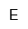

2 / 14

<pre>
(3*4)+2
&#8593;
</pre>
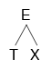

3 / 14

<pre>
(3*4)+2
 &#8593;
</pre>
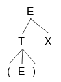
Now that we've derived the '(', we can move on to the second token of input, '3'.

4 / 14

<pre>
(3*4)+2
 &#8593;
</pre>
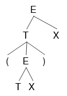

5 / 14

<pre>
(3*4)+2
  &#8593;
</pre>
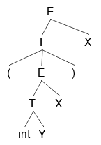

6 / 14

<pre>
(3*4)+2
   &#8593;
</pre>
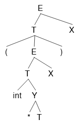

7 / 14

<pre>
(3*4)+2
    &#8593;
</pre>
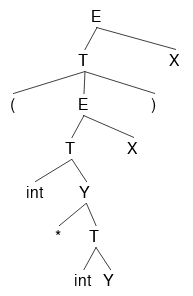

8 / 14

<pre>
(3*4)+2
    &#8593;
</pre>
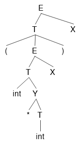
Since the row 'Y', column ')' entry is 'epsilon', Y is nothing, and we do not need to represent it anymore.

9 / 14

<pre>
(3*4)+2
     &#8593;
</pre>
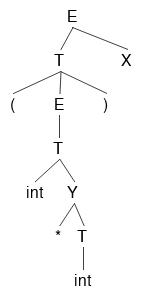
After we delete the X that turned out to be an epsilon, we hit the ')', and consume it.  Only writing this because it may not be immediately clear.

10 / 14

<pre>
(3*4)+2
     &#8593;
</pre>
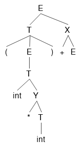

11 / 14

<pre>
(3*4)+2
     &#8593;
</pre>
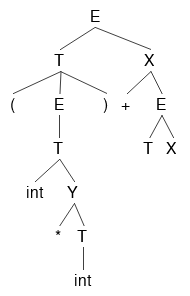

12 / 14

<pre>
(3*4)+2
      &#8593;
</pre>
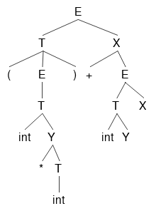

13 / 14

<pre>
(3*4)+2
      &#8593;
</pre>
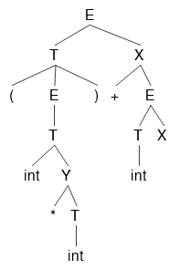

14 / 14

<pre>
(3*4)+2
      &#8593;
</pre>
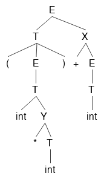
Here is our finished parse tree.  We can turn it into an AST by getting rid of all the non-terminals, which I don't feel like doing.

`How parsing tables are constructed`

Looking at our parsing table again, we know that if our current non-terminal is 'T', and our current terminal is '(', we should choose the production '(E)', and if an 'int' is our terminal, we should choose the production 'int Y'.  What we don't know is how to make a parsing table like this.  How should we know to assign T['T', '('] -> '(E)' in the first place?  Now we will show you.

In the DFA table, we had a current state, and a next token which would determine our next table lookup.  In our LL(1) table, we have a current non-terminal instead of a current state.  Each table lookup has this form:

	T[A, t] = X
	
TODO how is the parsing table really created?  What 2 things do we have, what 3rd thing are we looking for?  Iterate over each position in the table?  Iterate over all possible terminals?  And why can we have 2 things (like a TX) in the parsing table?

So we have our parsing table with non-terminals as rows and terminals as columns, and nothing in the entries.  For each non-terminal, we iterate over its productions.  For each production, we calculate that productions first set using the first and follow sets of each thing it contins.  Then we look at that productions first set.  For each terminal in the productions first set, we put that production in at the entry (non-terminal, terminal).

First Sets

`T[A, t] = B` if t is in the first set of B.  
The first set of a non-terminal B is the set of all terminals that appear first in B's derivation.

	A -> Bx | Cy
	B -> 0 | 1
	C -> a | epsilon
	
In this grammar, the first sets of A, B and C are:

	A : { 0, 1, a, y }
	B : { 0, 1 }
	C : { a, epsilon }
	
B and C are trivial, so I'll skip those.  A's first set looks like it does because when A is derived all the way down to terminals, it could look like any of the following:

	0x
	1x
	ay
	y
	
Since we want the first terminal that can be derived from A, we end up with 0, 1, a, and y.

So if we're at A, we will transition to B if `t=0` or `t=1`.
TODO I this is wrong.  What happens after we get to B?  We just die.

In general, finding the first sets for each terminal and non-terminal in a grammar is as follows:

	t : { t } // if t is a terminal symbol
	First(Y) is a subset of First(X) if X -> Y....
		or X -> ABCY....
			and A, B, C can all be epsilon.
	epsilon is an element of First(X) if:
		X -> epsilon
		or
		X -> ABC
			and A, B, C can all become epsilon

Follow Sets

Here's the definition of a follow set for non-terminal X:

	Follow(X) = { t | Y ->* AXtB }
	
What this says is that t is in Follow(X) if Y's multiple-step derivation contains X, and also has some terminal t after it.  

The start symbol S's follow set will contain only `$` (end of file).

<a class="prev" onclick="plusSlides1(-1)">&#10094;</a>
<a class="next" onclick="plusSlides1(1)">&#10095;</a>

Step 1 / 14:  Start at E
<pre>
Follow(E) = { $ }
Follow(T) = { }
Follow(X) = { }
Follow(Y) = { }
Follow('(') = { }
Follow(')') = { }
Follow('+') = { }
Follow('*') = { }
Follow(int) = { }
</pre>

Step 2 / 14:  Look at E -> TX
<pre>
Follow(E) = { $ }
Follow(T) = { First(X) }
Follow(X) = { Follow(E) }
Follow(Y) = { }
Follow('(') = { }
Follow(')') = { }
Follow('+') = { }
Follow('*') = { }
Follow(int) = { }
</pre>

Step 3 / 14:  Look at T -> (E)
<pre>
Follow(E) = { $, ')' }
Follow(T) = { First(X) }
Follow(X) = { Follow(E) }
Follow(Y) = { }
Follow('(') = { First(E) }
Follow(')') = { Follow(T) }
Follow('+') = { }
Follow('*') = { }
Follow(int) = { }
</pre>

Step 4 / 14:  Look at T -> int Y
<pre>
Follow(E) = { $, ')' }
Follow(T) = { First(X) }
Follow(X) = { Follow(E) }
Follow(Y) = { Follow(T) }
Follow('(') = { First(E) }
Follow(')') = { Follow(T) }
Follow('+') = { }
Follow('*') = { }
Follow(int) = { First(Y) }
</pre>

	

Step 5 / 14:  Look at X -> +E
<pre>
Follow(E) = { $, ')', Follow(X) }
Follow(T) = { First(X) }
Follow(X) = { Follow(E) }
Follow(Y) = { Follow(T) }
Follow('(') = { First(E) }
Follow(')') = { Follow(T) }
Follow('+') = { First(E) }
Follow('*') = { }
Follow(int) = { First(Y) }
</pre>

Step 6 / 14:  Look at X -> epsilon
<pre>
Follow(E) = { $, ')', Follow(X) }
Follow(T) = { First(X) }
Follow(X) = { Follow(E) }
Follow(Y) = { Follow(T) }
Follow('(') = { First(E) }
Follow(')') = { Follow(T) }
Follow('+') = { First(E) }
Follow('*') = { }
Follow(int) = { First(Y) }
</pre>

Step 7 / 14:  Look at Y -> * T
<pre>
Follow(E) = { $, ')', Follow(X) }
Follow(T) = { First(X), Follow(Y) }
Follow(X) = { Follow(E) }
Follow(Y) = { Follow(T) }
Follow('(') = { First(E) }
Follow(')') = { Follow(T) }
Follow('+') = { First(E) }
Follow('*') = { First(T) }
Follow(int) = { First(Y) }
</pre>

Step 8 / 14:  Look at Y -> epsilon
<pre>
Follow(E) = { $, ')', Follow(X) }
Follow(T) = { First(X), Follow(Y) }
Follow(X) = { Follow(E) }
Follow(Y) = { Follow(T) }
Follow('(') = { First(E) }
Follow(')') = { Follow(T) }
Follow('+') = { First(E) }
Follow('*') = { First(T) }
Follow(int) = { First(Y) }
</pre>

TODO algorithm for computing follow sets
 
You should just ignore this part for now.  It's not necessary to know how to make these first and follow sets.  Just know how to recognize them.  It's a complicated exponential runtime algorithm.
Here is the general algorithm for getting follow sets, which we run on each production: 

	for each  nonterminal on the right side of X -> ABC....Z:
		Follow(A) += First(B)
		if epsilon in First(B)
			Follow(A) += First(C)
			if epsilon in First(C)
				....
				if epsilon in First(Z)
					Follow(A) += Follow(X)
					
		Follow(B) += First(C)
		if epsilon in First(C)
				....
				if epsilon in First(Z)
					Follow(B) += Follow(X)
					
		Do this for all of them
		TODO should make a recursive version of this.  Also should have a portion that takes into account whether First(B) is already in Follow(A), etc.
		

Now we'll compute follow sets for this grammar, where E is the start symbol:

	E -> TX
	T -> (E) | int Y
	X -> +E | epsilon
	Y -> *T | epsilon

computing follow sets example

In this example, keep in mind the first sets from the previous example.

This is really long, so I'm not going to finish it.  It would have been nice to have the ability to do slideshows.  Stupid markdown.

	

building the parsing table after you have first and follow sets

TODO potentially put the first follow algorithms + examples here instead.
TODO look at video LL1 parsing tables again.  The `T[A, t] = B` thing. How do you know what the next A is?  It's actually the leftmost nonterminal in your current derivation.  Going to have to go back and change that.  If the leftmost thing is a terminal, then `T['int', t]` is a pointless lookup, since you can just do a direct comparison:  `'int' == t`.  For simplicity you could do a table lookup, or maybe this is faster.  Whatever.  Just do what you think would be easier to explain.

Now that we have the first and follow sets for each terminal and non-terminal, we can find all the t's for each `T[A, t] = B`.  

	for all non-terminal combos A and B in your language:
		for each t in First(B):
			T[A, t] = B
		if epsilon in First(B):
			for each t in Follow(A):
				T[A, t] = B

How does the parser decide whether to shift or reduce?  For example, why does step 2 -> 3 do a Shift, rather than Reduce by Production 1: T -> int?

Let's see what happens if we did reduce by production 1 rather than shifting.  Rather than some mysterious way of shifting and reducing, we'll reduce whenever it's possible.

	Step 1:   | int * int + int
	Step 2:   int | * int + int
	Step 3:   T | * int + int
	Step 4:   E | * int + int
	Step 5:   E * | int + int
	Step 6:   E * int | + int
	Step 7:   E * T | + int
	Step 8:   E * E | + int
	Step 9:   E * E + | int
	Step 10:  E * E + int |
	Step 11:  E * E + T |
	Step 12:  E * E + E |
	
And now we're stuck.  There's nothing left to shift, and we also can't reduce anything.  Since we couldn't reduce to a single start symbol E, we don't know in what order to execute * or +, which means we can't create a binary for the input program.  How the parser actually knows whether to shift or reduce is a pretty complex topic, and will be covered later.

Why does the table say to shift at this step?  Why can't we reduce at this step?
Let's see what would happen if rather than using the table, we reduced as much as possible, shifting only when there was nothing left to reduce.
	asdfasdf
Ok, now we're stuck.  So we can't just reduce whenever possible.  The purpose of the table is to tell us exactly what action to take, whether it's a shift or reduce.  Without the table, we would have to guess at which production to use next.  We could potentially use the wrong production and get stuck.