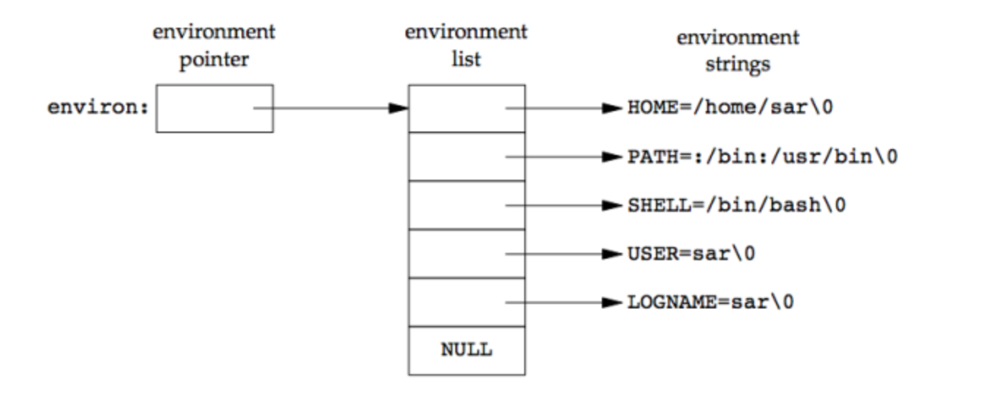

#Financial Wizardry
You need money, right? Quick advice: invest in ETFs, put money into your 401k, then your roth ira. Below is a chart from reddit. It's a little small, maybe open it separately.

Personal Finances Chart

`Federal Taxes` below is a guide for how to do your federal taxes.  State taxes are a separate issue.

https://www.artofmanliness.com/articles/taxes-for-beginners/

`Tax Deductions` If you make 20k in total, and you write off your car repair costs (3k) as a tax deduction, you will only be taxed on 17k.  This is `itemized` tax deduction.  In order to do this, you need to keep the receipts.  Odds are you should just go with the `standard` tax deduction, which is 5.8k.

`Tax Credit` For every dollar you pay towards X, you subtract that dollar from the dollars you have to pay to the US Government.  For stuff like paying back student loans.  Below is a link to the tax credits you might be eligible for.

https://turbotax.intuit.com/tax-tips/tax-deductions-and-credits/the-5-biggest-tax-credits-you-might-qualify-for/L3o8qrNnC

`Tax Refund`  Each paycheck you get, the government takes a portion of it immediately.  You don't get all of it, then every year the government asks for several thousand dollars.  Most (dumb or poor) people spend all their money as soon as they get it.  So everyone would be declaring bankruptcy all the time.  So the government has to guess how much money it should be taking from you.  Since you will be making 50 an hour 3 months out of the year, the government will probably be taking a much larger chunk of your money than you initially expected.  This is when you file for a tax refund.

In other words, the government assumes certain things about your paycheck, and at the end of each year, you will correct their assumptions by showing that you actually made a lot less money than the government initially thought you did.

`Mortgages and Housing` My current thoughts on saving for a house is that it is not worth doing for you specifically.  If you want maximum time to work on your projects, you can't be pre-occupied with saving for a house.  This is just the risk that you'll have to take if you want to be able to take on large projects like you want to.  I know it hurts to put money towards rent.  It feels like you're throwing that money away.  But compared to buying a house, it's not that much, at least in the short term.  And you can also live with other people.  Can't do that if you buy a house.  

#Code Structures

Interface

Languages like Java and Go, and C++ all have very similar but not identical concepts called interfaces.

An interface is roughly equivalent to an abstract class.  You can't create a variable with that specific type, but you can create classes that inherit from it.  Any class that inherits from this abstract class is said to 'implement its interface'.  In the below example, we have an interface called TimeMachine, and a PhaseShiftor and HyperCube class that implement it (since obviously shifting your phase and using a hybercube are 2 different ways to time travel).  You 

The purpose of an interface is so a user can call a method and know what will happen without having to know how it happens.  A more practical example would be something like a sort interface.  MergeSort and Quicksort could both implement it, since all they do is sort a list of numbers.

Example

	Interface TimeMachine:
		void goToYear(int year)
		
	
	
	Class PhaseShiftor implements TimeMachine:
		void goToYear(int year
	
	Class Motorcycle implements Vehicle {
		int gasLevel = 0;
		int milesPerGallon = 50;
		void takeGas(int amount) {
			gasLevel += amount;
		}
		int milesPerGallon() {
			return milesPerGallon;
		}
		void go() {
			System.out.println("Went " + str(milesPerGallon * gasLevel) + " miles");
			milesPerGallon = 0;
		}
	}
	Vehicle[] vehicles = new Vehicle[4];
	
	/* put cars and motorcycles in the array.  Hidden on purpose.  */
	
	for (vehicle : vehicles) {
		vehicle.takeGas(10);
		vehicle.go();
	}

In this example, we don't know whether each vehicle in the array is a car or motorcycle, but it doesn't matter, because either way you know that you can call takeGas, milesPerGallon, and go.  Note that you cannot create a Vehicle object.  You must create a class that implements the Vehicle interface.  In this way, a vehicle is like something like an abstract class. 

Interfaces aren't exactly the same in all languages.  In C++, there is no keyword for interface.  However, you could make something equivalent to a Java interface in C++ by creating an abstract class with purely virtual methods.  Then any class that inherits from this abstract class must implement these virtual methods.

Go example

In Go, interfaces are explicitly declared and implicitly implemented.  This means you create an interface by saying `type myInterface interface {...}` but unlike Java, there is no need to say `class X implements myInterface` in order for X to be able to use myInterface.

	package main
	import "fmt"
	import "math"
	
	type geometry interface {
	    area() float64
	    perim() float64
	}
	
	type rect struct {
	    width, height float64
	}
	type circle struct {
	    radius float64
	}
	
	func (r rect) area() float64 {
	    return r.width * r.height
	}
	func (r rect) perim() float64 {
	    return 2*r.width + 2*r.height
	}
	
	func (c circle) area() float64 {
	    return math.Pi * c.radius * c.radius
	}
	func (c circle) perim() float64 {
	    return 2 * math.Pi * c.radius
	}
	
	func measure(g geometry) {
	    fmt.Println(g)
	    fmt.Println(g.area())
	    fmt.Println(g.perim())
	}
	func main() {
	    r := rect{width: 3, height: 4}
	    c := circle{radius: 5}
	
	    measure(r)
	    measure(c)
	}
	
Here is an interface called geometry.  Both the rect and circle structs implement it without the need to say 'implements geometry'.  Go knows that rect and circle implement the geometry interface simply because both structs have an area and perim method.

Why does Java have interfaces and abstract classes?  Why not just use abstract classes?

I think it's to avoid the problems associated with multiple inheritance.  If you inherit from multiple parent classes, I think there's certain type stuff that can get a little bit unwieldy.  If you inherit from 2 classes, but 1 of those classes is a purely abstract class, you could turn it into an interface.

But I'm not entirely sure on this definition.  It might just be some extra syntax to make things clearer.  In my opinion it makes things more complicated, but that's just the language that java is.

Why use getters and setters?

	
	class Doggo:
		int bork = 4
		
Lets say you have this doggo class, and you don't want people to be able to change your bork.

	class Doggo:
		private int bork = 4
		
Cool.  But now no one knows about your bork but you.  You want people to be able to see your bork, but not change it.  You can do that with a public getter.

	class Doggo:
		private int bork = 4
		
		public Get():
			return bork
			
Now everyone can use Get to see a copy of your bork.  They will be able to change the copy of their bork, but they won't be able to change yours.  So that's getters.

What about setters?  Lets say you have some food, and it's ok to share it with people.

	class Doggo:
		private int bork = 4
		private int fud = 2
		
		public int Get():
			return bork
		
		public int Set():
		

	Doggo gb = Doggo()
	
//TODO provide an example that shows that it's more mutable.  People calling the code won't have to go back and change it.
 

Threads

Think of threads as jobs, not as workers.  It's important that you can spawn as many threads, or jobs as you want.  Your operating system has to output video, audio, listen for mouse clicks, keyboard input, watch power consumption, etc.  That's a lot more than 4 jobs.  If you could only run 4 jobs at a time the user would think their computer was super slow.  Well, not super slow, it just wouldn't function at all.

Another way to think about it is that your computer is your stay-at-home mom.  She has 4 tasks on hand: doing laundry, washing dishes, making breakfast, and vacuuming.  If your mom wanted to do the tasks in the order that saved the most time, she should probably do the laundry and the dishes before making breakfast or vacuuming.  She can load the clothes / dishes into their respective machine, and they'll keep working while she cooks and cleans.  But lets say its your first day back to school, so you have to leave soon.  If she does the laundry or the dishes, you'll have to leave before breakfast is done.  Being a smart mom, she makes breakfast for everyone first, even though it will take more time overall.

It's the same principle for your computers scheduler.  If you want to listen to music while reading a pdf, it would be most computationally efficient for your computer to play the entire song, then open the pdf, then let you scroll through it.  But that's obviously not what you want, so your computer switches between these two tasks (threads) very rapidly in order to make it seem like both things are happening at the same time.

Events, Asynchronous Methods, Callbacks

If a method is asynchronous, calling it will spawn another thread or process.  Imagine a user clicks on a desktop icon.  The method for opening up the app corresponding to the icon should be asynchronous, because if it wasn't, the user couldn't move their mouse after clicking the icon.  Asynchronous calls are important even if you only have 1 core.  Think of a thread as a job, and a core as a worker.  If you only have 1 worker, you can't have them work on just 1 job at a time.  That would be bad for the user.  So our 1 worker juggles multiple jobs at the same time, and users have the illusion that many operations are happening simultaneously.  

An event is just 'something that has happened'; a mouse click, a keyboard input, a new email, etc.  Since these things happen all the time, we need asynchronous methods that can run concurrently in order to catch and handle all these events.

But we don't just want async methods to catch events, we also want to tell them what to do with the events.  We can do this by passing the async method a callback function as a parameter.  An example is when you set onClick in an html tag.  The thing that you set onClick to is the callback function.  Maybe your callback function plays an animation, or redirects the user to another page through a link.

You might wonder 'Why do we need to pass a callback in as a parameter?  Why not just put that code directly into the asynchronous function?'  To answer that, think about this scenario:  you have a website that has a whole bunch of different clickable buttons.  Some buttons link you to other pages, some buttons open drop down menus, some display images.  All of these buttons have asynchronous functions behind them, waiting for clicks.  But when they get a click, they all do different things.  If you had to program all these buttons, it would be much easier to write the part of the program that listens for clicks once, rather than copying and pasting it again and again for every single button.  So the reason callback functions are so common is that asynchronous functions often just listen for events, so passing in the 'what to do after you get the event' logic as a parameter is easier than writing it directly into the asynchronous method.

`polymorphism` Another somewhat loaded term.  I would say it usually refers to function overloading.  Consider the following 2 functions:

	int Add(int x, int y) {
		return x + y;
	}
	
	int Add(int[] x, int[] y) {
		return sum(x) + sum(y);
	}
	
Notice they have the same name, the same return type, but different parameters.  Some languages allow this, as they differentiate function calls by looking at the parameters.  Other languages don't bother doing this, and so don't allow this kind of method naming.

`first class function` If a programming language supports first class functions, this means you can pass functions as parameters, return them from other functions, etc.  Basically means you treat functions as data, like any other variable.

`Higher-order function` Also called functor.  A higher order function is a function that takes functions as arguments, returns a function, or both.

`closure` related to first class and higher-order functions, a closure is a function returned from a higher-order function (its parent) that can still access its parents variables.  Example:

	def makeHuman():
		noise = "oh no"
		def human():
			print(noise)
		return human
		
	x = makeHuman()
	x() #will print "oh no"
	
In this example, x assigned the human function.  When x is called, it knows the value of the 'noise' variable, even though it is outside the scope of human.  Of course, calling 'print("oh no")' would achieve the same thing.  The real power of closures is that they can do many of the same things that classes/objects can do:

	def makeMathematician():
		favoriteNumber = 4
		def getNum():
			return favoriteNumber
		def setNum(num):
			favoriteNumber = num
		return getNum, setNum
		
	x = makeMathematician()
	print(x.getNum()) #will print 4
	x.setNum(8)
	print(x.getNum()) #will now print 8

If closures and classes are so similar, which one should I use?

Classes and objects are much faster than closures.  I'm not really sure why.  I would say use classes when you can.  The mathematician example would actually be better represented as a class, I think.  For some languages like javascript, the only way to get classes is through closures.  So for now, I would treat closures as something to be dealt with, not something to actively try to use.

`Design patterns` aren't a library or a concrete feature of a language.  They're a way to structure code.  They're the vague kind of techniques that differentiate 'good' from 'bad' code.  If used correctly, they shoud make code more clear, more reusable, and more extendable.  If you're about to dive in to a large code base, it might help to google <type of software> design patterns.  Security design patterns, simulation design patterns, etc.  Probably the most important thing you can take away from design patterns is that they're not something you set out to use.  They're a result of the fact that most software does very similar things, and end up implemented in similar ways.  So keep them in mind, but remember that the term 'overdesigned' is used a lot more often than 'underdesigned' in the software industry, at least in my experience.

There's a famous book called 'Design Patterns: Elements of Reusable Object-Oriented Software' where most of these common design patterns get their name.  I wouldn't read it.  However, if you look at the following list:

	Abstract Factory, Builder, Factory Method, Prototype, Singleton, Adapter, Bridge, Composite, Decorator, 
	Facade, Flyweight, Proxy, Chain of Responsibility, Command, Interpreter, Iterator, Mediator, Mememto, 
	Observer, State, Strategy, Template, Visitor
	
You might have seen some of these terms as part of a function name, class name, type, etc in some piece of code that you read.  These terms are the design patterns described in the book.  So if you come across a piece of code that you don't understand, and it has one of these words in the name, you can google 'design pattern X' to get a high level understanding of the piece of code you're looking at.  Most of these I think aren't useful, though.  Below are the ones that I do find useful:

`Design patterns: factory method` One of the simplest and most useful patterns.  If you're making an API that has a lot of different related objects, you use a factory method to simplify creation of those different objects for the user of the API.  Consider this example that does _not_ use a factory method:

	//API
	abstract class Vehicle:
		void printWheels():
			print(0)
			
	class Motorcycle inherits Vehicle:
		void printWheels():
			print(2)
			
	class Car inherits Vehicle:
		void printWheels():
			print(4)
	
	//User of API
	class Person:
		Vehicle myVehicle = null
		
		Vehicle buyVehicle(vType):
			if vType == 1:
				myVehicle = Motorcycle()
			elif vType == 2:
				myVehicle = Car()
			
Seems pretty simple.  But what if the makers of the API wanted to add new types?  Bikes, skateboards, jet skis, big rigs, etc.  For every new subclass you add to the API, the user of your API will have to add another elif to their buyVehicle function.  Instead, we should do that for them.  Here's the same API, but now with a factory method called manufacture:

	//API
	abstract class Vehicle:
		void printWheels():
			print(0)
			
	class Motorcycle inherits Vehicle:
		void printWheels():
			print(2)
			
	class Car inherits Vehicle:
		void printWheels():
			print(4)
			
	Vehicle manufacture(int vType):
		if vType == 1:
			return Motorcycle()
		elif vType == 2:
			return Car()
		else:
			return null
	
	//User of API
	class Person:
		Vehicle myVehicle = null
		
		Vehicle buyVehicle(vType):
			myVehicle = manufactor(vType)
			
So our API code gets more complicated, but it's easier for the user now.  There could be a million different vehicle types and the user wouldn't need to change their implementation.  And since there's hopefully going to be a lot more users of the API than creators of the API, this should save a lot of typing for most people.

`Design patterns: singleton` A singleton is a class that you should only ever need 1 object of.  For instance, if you are playing some game app, there's probably a class called game that contains everything else.  You don't want more than 1 game running at a time, so you would make that class a singleton.  It's pretty simple to implement.  Here's a java example:

	class Singleton:
	    static Singleton obj = new Singleton();
	 
	    private Singleton(): pass
	 
	    Singleton getInstance():
	    	return obj
	
The obj object is the 1 instance of our class.  Notice the constructor is private, so no one can create another obj.  1 obj is created on start up, and you can interact with that 1 obj by calling getInstance.

`design patterns:  MVC` stands for Model-View-Controller.  Technically all 3 of these are design patterns on their own, but they're usually lumped together.  This design pattern is used very commonly in web development (which is basically the wild west of software; always changing, basically no rules.  At least no rules that stick around for more than a few years), so I won't write too much about this.  The model is the data.  User data, embedded videos, ability to comment on things, etc.  It's all the functionality of the website.  The view is the user interface.  It changes itself when it sees a change in the model.  The controller handles events.  It watches the user (and other possible events) and changes the model accordingly.  So the controller watches the user, the user watches the view, the user interacts with the view the controller changes the model accordingly, the view watches the model, the view changes itself accordingly.

Right now, you could say that 'backend' code like Go or backbone.js make the model, react.js is for making the view, and node.js is for making controllers.  But that's probably going to change once again a few years from now.

`design patterns:  template method` Basically just a very generic higher order function, or abstract class.  Implement the parts that are common between all the sub-parts, then leave the other parts unimplemented for someone else to implement.  Or provide a default anyway and let other people overwrite it.

Here, worker is the template method, whose work submethod gets replaced for each different worker.  The term `hook` is often used for the parts of the template that the user fills in.

`Pagination` Lets say you have some application, and a user makes a really big request, for 1000 pictures, let's say.  The apps UI would take forever to render 1000 pictures all at once.  You could either 

a) go through with the request and make the user wait a few minutes

b) not give the user what they explicitly asked for

c) paginate the request, giving them a little bit of what they asked for (say a page of 10 pictures), to which the user could then request the next 10 pages, then the next 10, etc.

Guess which one is best?

#Databases

There are 2 types of databases:  relational (anything with SQL) and non-relational (NoSQL, like MongoDB).  The first section will talk about relational databases.

`Tables` are the basic method of storing data.  Each `column` in the table is a type of data.  Here's an example of a table of cities:

name      | population | area (km^2)
---------------+---------+---------
 Oakland  |      420k    |      201.7
 San Francisco |      871k |      121.4
 Barstow       |      24k |      107.2
 
`Databases` are collections of related tables.  If the columns of 1 table are the rows of another table, those tables are related.  Here's a table that relates to the  city table:

region         | cities
---------------+---------
 Bay Area       |     San Francisco, Oakland
 Central Valley |      Sacramento, Chico
 Desert       |      Barstow, Riverside
 
 
This region table is related to the cities table because its second column contains some of the same data as column 1 of the cities table.  So if you want information on a region of california, you can look in the regions table.  Some of the stuff you find in the regions table can be used to look up further information in other tables.

`SQL` is a programming language for finding and modifying data in a database.  It is made up of a very small number of operations, for example Create, Delete, and Select.  ISO and ANSI control the language specification, but don't actually implement any of it.  There is no implementation of SQL called 'SQL' that you can download.  The implementations that you can download include MySQL, PostgreSQL, and so on.  While each flavor of SQL has different functions, they all more or less implement the same basic components of SQL.

To actually use SQL, just look at the W3C tutorials on SQL. 

#Operating Systems

Why do Linux users always use thinkpads?

Canonical and Red Hat certify which laptops can run Linux.  Pretty much all Thinkpads are certified.  If you have a laptop that is not certified to run Linux, there might not be a sound driver, or a wifi driver, and you're wrecked.

Why are there so many flavors of Linux?

Some kinds of Linux adhere to the free software spirit, which people like.  Others have a pretty desktop environment.  If you want to know whether switching from MacOS to Linux will make you a better programmer, it won't.  However, switching from Windows might be a better experience.  Empirically, I've found Unix based systems to be easier to develop on, as most common development software like GCC and Clang work out of the box on those.  However, Windows would require Cygwin in order to run that software.  Installing more software is never fun.

`What is the difference between all of these Linux flavors?` That's difficult to say.  Instead of actually telling you the differences, I'll say that for the vast majority of users, the difference is so small that it doesn't matter in the slightest.  The real question that you want to ask is "which Linux distro should I choose?"  To that, I would say you should choose the distro that will give you the fewest headaches.  Here's an article that talks about which distros are the most popular:

https://www.zdnet.com/article/whats-the-most-popular-linux-of-them-all/

While this may not seem to relate directly to a comparison between linux distros, notice that based on Google Analytics, Ubuntu is by far the most searched for out of all linux flavors besides Android.  If you ever run into a problem with linux, most of the answers on the web will be solutions specifically for Ubuntu.

Now consider that most people use Ubuntu for their servers.  Ubuntu is the most popular according to Amazon AWS.  You should just use what will work.  Wait.  Ubuntu isn't open source.  Ouch.  But maybe closed source isn't too bad.  It's not like Canonical will ever take away features, or pull the rug out from under you and start charging money for any use.  So the worst case scenario is that Canonical won't improve the features you care about, since those features are free, and therefore won't make Canonical much money.

Virtual Machine

Your computer has an operating system, probably either Windows, MacOS, or Linux.  Within your operating system, you can use software like virtualbox to run another, different operating system inside of your current one.  So you can run Linux in Windows, Windows in MacOS, etc.  Useful if you need some functionality of both operating systems.

Container

A container is like a virtual machine, but lighter weight.  While a VM requires you to have a whole copy of an operating system, a container only requires you to have a copy of the parts of an operating system that you want to change.  Let's say you are running Linux, and you want to be able to run both python2 and python3.  Those might conflict with each other, so what you can do is create a container image for both of them.  The container image will have a copy of your .bash_profile (your PATH variable) and a different set of files in /lib/python.  With virtual environments, you would have to have Linux running on your computer, and 2 more images of Linux on top of that.  That means 3 copies of the kernel, 3 copies of GNU, 3 copies of every file on your computer.  That's a lot of memory, and it tends to be slow.  With containers, you start with just 1 copy of everything, then you make 2 more copies of your path variable, modify them, and 2 more copies of your python libraries, and modify them.  In a way, it's kind of like branching in a git repository, but for your operating system.  You only need to make a copy of things you are going to modify.

So, VMs are big and slow.  Containers are small and fast.  However, the more you modify in a container, the bigger it gets, and the more like a VM it becomes.

Of course, python virtual environments also solve this problem, but that's just for python.  Containers work for any piece of software you can think of.

Python Virtual Environment

Python VE's predate most container stuff that we know.  They're very similar, but outdated compared to containers.

`vagrant`
Allows you to make a VM, configure it, then share it with other people.  Requires virtualbox / vmware.  Used in businesses when you want everyone to run their code on the exact same system.  Solves the problem of 'but it runs on my machine'.  Why not just make a configuration in vmware / virtualbox, then share it with everyone?  Because then they can modify it (intentionally or not) which you don't want.  The whole point is to have everyone on the exact same system, and if they're able to modify their system, that defeats the purpose.

`Environment List`
When programs are compiled, linked, run, etc, how do they do various things like find standard libraries, know what shell it's being run in, who the current user is, etc?  Through the environment list, otherwise known as the program environment.  The environment list is passed to your program by whatever is running it (usually a shell), and is available globally.  Below is a diagram of a simpmlified environment list.  The real environment list contains dozens if not hundreds of name:value pairs.  Some other examples of environment variables might be SESSION=ubuntu, SSH\_AGENT\_PID=1508, etc.

`PATH variable`

To write Hello World in C, the first thing you do is `#include <stdio.h>`.  How does the compiler know where stdio.h is?  It looks for the PATH variable in the environment list.  The PATH variable specifies where to find all your standard libraries.  On MacOS, the PATH variable is usually contained in `~/.bash_profile`.

`CentOS`  completely free fork of RedHat.  Purely community backed.  Competes with Debian for use as server OS.

The command line is a programmers home.  GUI applications full of buttons are slow, clunky, and prone to bugs.  Command line tools are fast and simple.  Good GUI applications just wrap around command line applications anyway.  A good example is how github wraps around git.

All of the following bash commands can be called from a bash script.  You can string them together to do stuff.
#Development Tools and Environment

`environment`  everything your program needs so it can run.  In order to know whether something is part of your programs environment, ask yourself this:  If I deleted this while my code was running, would my program still function correctly?

The environment of the calculator app on your computer would include the C/Java source code that it's made from, the libraries it calls, graphical drivers to display it, kernel code, etc.  The parts of our environment that we care about are the parts that we might actually want to modify, like compiler options and downloaded libraries.

`dev tools` anything that helps you write, run, monitor, and manage code.  Sublime, atom, intellij, and visual studio for writing code.  Compilers and interpreters for turning code into binary, like GCC, Clang, python Idle, and the Java Development Kit.

`terminal` The black screen with green hacker text.  The most fundamental tool of any software developer.  All other tools run off the terminal.  Whenever you open file explorer, or an internet browser, that app is just a terminal with a fancy graphical disguise.  

Let's say you mouse over something like a folder, hyperlink, or desktop icon, and click it.  That thing says 'can do', turns around, and just enters commands into a terminal that you can't see.

Why use a terminal instead of a graphical application?

Because most software development tools don't have a GUI at all, which means a terminal is your only option.

Consider google docs.  All you ever want to do is type text, save text, and make text pretty.  There isn't much variation in what the user wants google docs to do.

Now consider visual studio, an IDE for writing code.  Users of visual studio might want to write code, compile code, find code in a different file, replace a whole bunch of code in different files all at once, change compiler options, back up code to some other storage, debug code, add in some random tool that is constantly monitoring your code, etc etc etc.

Visual studio's job is a lot more complicated than google docs.  Making a graphical interface for this app is a lot harder than making one for google docs.  If you want to create a tool that is simple to use, free of bugs, and doesn't take your entire life to create, it's much easier to create a command line app than a graphical app.

Yes, there are plenty of graphical apps for software development.  But you _will_ run into plenty of instances in software development where you need to get something done, and an appropriate GUI app simply won't exist.  Even if there is a graphical app, it's almost certain that there is also a command line app that does the same thing that will be simpler to use.  As a beginner software developer, all you do is move files around and type text.  It may feel like using the command line is harder.  But that feeling won't last more than a few years.

You shouldn't shun GUI apps though.  Most software devs do use GUI apps (mostly IDE's) to write code.  But at the same time, they still use the command line for basically everything else.

Useful cheat sheet for any basic bash scripting stuff:  https://devhints.io/bash

What is a terminal?  What is a shell?  Why do we use them?  The default shell for MacOS is 'Terminal' and for Ubuntu is 'GNOME shell'.  Both of these are BASH shells.  Maybe consider xterm.  It works on both macOS and Linux.  Or there's Terminator, which runs on windows, macOS, and Linux.  Why stop there?  Why not also choose a package manager that works on all 3 systems?  Be completely computer agnostic.  Think of a shell like this:  everything you see on your computer is just a shell in disguise; just wrapped up to look fancy and be easy.  When you click a button on your desktop, or on an app, what happens is the button just turns around and types that command into the terminal.  Maybe give them an example.  When you click google, what actually happens is this command:  asdasfsdf.  Then another terminal opens up.  It's the google chrome terminal.  Then you type stuff into the google chrome terminal.

Bashrc vs bash_profile?

`command prompt` If you have a dollar sign at the end of your command prompt, you're a normal user.  If it's a pound sign, you're admin.

`su <username>` stands for substitute user.  Logs into another user on top of your current user.  'su' with no arguments will make you root.  When you're done, use the `exit` command to go back to being a normal user.  Don't su back into your original account, because then you'll have user->root->user, which is confusing.  Also potentially slower?  You probably wouldn't notice it though.

`sudo <command>` Elevates your privileges for the single command.  Same thing as doing 'su', followed by '<command>', followed by 'exit'.

Why am I getting 'command not found' errors when I do 'sudo cd <folder name>'?

Because cd is a built in command, not an executable file.  sudo only works on executable files.  If you want to cd into a folder that requires root permissions, switch to root with su, then cd as a separate command.

`Ctrl+C` interrupts the currently running process, which usually kills it.  If something is running and you want it to stop, use Ctrl+C.

`Ctrl+Z` suspends the current process, putting it to sleep.  The sleeping processes go on a LIFO stack, which you can wake up with the `fg` command.  You can also do `fg <sleeping process stack position>` to wake up that specific process.

`Unix file system`

`/` is the root directory.  It contains all other files in your system.

`~` is your home directory.  It contains all your documents, pictures, etc.  Actual path varies, on Linux its `/home`, on MacOS it's `/Users/<yourname>`.

For the following subdirectories I am only guessing as to their function.  Most of the reason why there are so many directories is just because of history.  There is no more need for much of this complicated heirarchy with its names that have little to do with what the folder actually holds.

http://lists.busybox.net/pipermail/busybox/2010-December/074114.html

`/usr` used to be the home directory.  Now it contains shared resources that aren't 'system critical' like shared libraries.

`/usr/include` contains header files.  This contains C header files.  Some non-C stuff might be here, but pretty much all OS's are written in C, so odds are this folder won't have much other than standard C header files.

`/usr/lib` contains the source code for most libraries for most languages, like C, C++, Java, Python, Go.  This and /usr/bin are where your package manager installs things.

`/usr/bin` contains the compiled binary versions of the source files in /usr/lib.

`/usr/local` everything here is for your 'local' user.  None of it is managed by a package manager.  You might want this for something like, I don't know, game files, photoshop, stuff like that?  Just stuff you don't want your package manager updating and potentially breaking.

`Unix file permissions` typing `ls -l` in a terminal will give you the permissions of each file in your current directory.  There are 3 types of permissions:  you can read the file, you can write to the file, and you can execute (run) the file as a program.  Here is the general format of each line when you run ls -l:

	drwxrwxrwx depth owner owners_group file_size modify_date file_name

First part is the actual permissiosn.  The d means directory, r is read, w is write, x is execute.  The first rwx is for the owner/creator of the file, the second rwx is for the group.  Most users don't belong to a group.  The third rwx is for all users.

Depth is how deep that folder subtree can go.

Owner is the creator of the file.  Systen files will have the creator 'root'.

Owners_group is the group that the owner belongs to.  It doesn't matter that much as far as I know.

The last 3 parts should be self-explanatory.

Here's an example of 2 typical lines:

	-rw-r--r--     1 cool_user  staff     739 May 14 13:46 README.md
	drw-------     3 root       staff      96 Jul  6 15:14 bin
	
Breaking this down, the first lines information is:  this is a file whose owner can read and write, and anyone else can only read.  Since it's a file and not a folder, it has directory level 1.  The user is cool_user, the group is staff, it is 739 bytes in size, it was last modified on May 14th at 1:36 pm, and the filename is README.md.

The second line says: this is a directory, only the owner can read or write to it, and it has 3 sub-levels (2 subdirectories that contain files at maximum). 

`symbolic link` Same thing as a desktop shortcut.  A file that is really just a pointer to another file.  If the original file gets deleted, the pointer will malfunction.

`help <bash command>` help is for bash commands only.

`man <something>` more general than help.  short for manuel.

`info <something>` works mostly on GNU stuff.  Try man first.

`find` command to search through file names.  Example:

	find ./my_projects -name *.txt
	
This will search through the file tree rooted at 'my_projects'.  It will look for and return any file ending in '.txt'.

`set` bash command that lets you set shell variables.  Doesn't seem useful on its own.  More useful with options
>`-e` exit immediately if a command exits with non-zero status.

`top` shows you the current processes running on your computer.  The unix version of control panel.  The most important columns are the ones labeled:  PID, USER, CPU, MEM, COMMAND.  PID is unique to each process.  It's the processes 'real' name.  USER is who is running that process.  Most will be root user, since root has to run a lot of stuff.  CPU is how many clock cycles the process takes up, MEM is how much RAM it takes, and COMMAND is a more 'user friendly' name.  If you have 2 web browsers running at the same time, say firefox, their COMMAND will both be something like 'firefox', but their PIDs will be unique, so you can differentiate between them.  There's also stuff like PR which is 'priority'.  Higher priority means the computer will spend longer on that task before switching.  NI stands for 'nice', which is related to priority.  Its kind of an optional priority modifier.  If your process is nice, that means it will yield if asked.  This might not be entirely correct.  Need more info on nice value.  There's also S.  Not sure what it stands for, but if the value is S, the process is asleep and not doing anything.  R means the process is running.  There's some other stuff I don't care about.

`kill <pid>` if you see a process in top that you want dead, you can kill it by specifying its pid with this command.

`pkill <name>` can also kill a process by using the value under COMMAND in top.

`systemd` This is the first process when you boot your OS.  It boots and monitors all userspace processes.

`systemctl`
ctl stands for control.  systemctl controls systemd, allowing you do do various things.
>`systemctl list-unit-files` lists all the services that systemd has available to run.
>
>`systemctl stop <process name>` stops user processes.  If you kill / pkill certain processes, systemd may start up another instance of it.

`journalctl` systemd logs things in a journal, and journalctl can be used to see those logs, oldest to newest.
>`-f` option stands for follow.  Will let you see the log as it is being written to.
>
>`-u <pattern>` show only the journal entries for units that match the pattern.  I'm pretty sure a unit is just a single entry/line in the journal.

`daemon` A background process that the user doesn't interact with.  Mostly a Unix term, but applies pretty consistently to all of computing.

#Git
Git is version control software.  When you make a project, whether it's code or an essay or a painting, you start with nothing, and gradually make changes until you get a final product.  You add changes, you remove changes, you start over, etc.  Without version control, all you have is the current version of your project.  There's no way to see the history of your project; what it looked like yesterday, a week ago, whatever.  With git, you can do this.  You can also split a project into 2 different projects and track both of them at the same time.  

`HEAD` is the current commit you're on.

`detached HEAD` If you check out a commit that isn't a leaf node in the git tree, you are in a detached HEAD state.  You won't be able to change anything, because that will be changing history.  If you want to change things based on an old commit, create a new branch off of that commit.

`git branch <new name>` Creates a new branch off of HEAD named <new name>
>`git branch -d <branch name>` deletes branch with name <branch name>

`git remote` This is where you push all of your changes so that other people can get them.

`origin` The default name for your remote repository.

`git add <file name>` Put something in your 'staging area'.  Means that you want to add it to the picture of your work.

`git rm <file name>` Delete something from your repo.  Deleting a file regularly will confuse git as from git's perspective the file magically disappeared.

`commit` Create a new snapshot of your work.
>`--amend` Allows you to put your added changes into your last commit, rather than creating a new one.  Useful when you forgot to change just 1 line, and don't want to make your commit history worse by adding an entirely new commit that only contains 1 line.

`clone`

`https vs ssh` https is easier, ssh is more secure.  A hacker can more easily intercept your stuff over https than over ssh.  ssh isn't too difficult, so I would use that one.

`merge <branch name>` Mash <branch name> into your branch.  If the same line has been edited on both branches, results in a merge conflict.  Have to go to the file and choose how it should look, 'resolving' the conflict.

`rebase <branch name>` Very similar to a merge, but cleaner history.  Rather than merging in <branch name>, you snap off your entire branch and place it on the end of <branch name>.  So it's like you didn't do anything until <branch name>'s latest commit.  Maybe a picture would help here.

`git tag` 'tags' your commit as being special.  Usually used for stable releases.  I wouldn't worry about this too much right now.

`git stash` for when want to save changes, but you're not sure if you want to keep them yet.  Maybe you're halfway through some experimental code that you haven't tested yet.  Don't want to commit it, so you can do git stash.  Note that this will put all the changes into a 'stash' and your working repo will go back to your last commit.  Also git automatically throws away old stashes.  It holds them somewhere between a week and a month.
>`git stash apply` reapply what you just stashed away.

`squashing`

`cherry pick`

`diff`

`autocompletion` can use tabs to have git guess what you're going to type.  Google it.

#Json

Json is a data format that is able to be read by humans as well as any programming langauge.  It's used to pass data between different languages.

JSON general format

	object
		{}
		{ members }
		
	members
		pair
		pair , members
		
	pair
		string : value
	array
		[]
		[ elements ]
	elements
		value 
		value , elements
	value
		string
		number
		object
		array
		true
		false
		null
	
	string
		""
		" chars "
		
	chars
		char
		char chars
		
	char
		any-Unicode-character-
	    except-"-or-\-or-
	    control-character
		\"
		\\
		\/
		\b
		\f
		\n
		\r
		\t
		\u four-hex-digits
		
	number
		int
		int frac
		int exp
		int frac exp
		
	int
		digit
		digit1-9 digits 
		- digit
		- digit1-9 digits
	
	frac
		. digits
		exp
		e digits
		
	digits
		digit
		digit digits
		
	e
		e
		e+
		e-
		E
		E+
		E-

General examples

	{ "yung arfy": {
		"legs": 4
		"bork": "arf arf"
		"good boy": true
		}
		
	  "ol borko": {
		"legs": 3
		"bork": "bOoOork"
		"good boy": true
		}
		
	  "precious": {
		"legs": 4
		"bork": "..."
		"good boy": true
		}
	}

	{"menu": {
	  "id": "file",
	  "value": "File",
	  "popup": {
	    "menuitem": [
	      {"value": "New", "onclick": "CreateNewDoc()"},
	      {"value": "Open", "onclick": "OpenDoc()"},
	      {"value": "Close", "onclick": "CloseDoc()"}
	    ]
	  }
	}}
	
	

#HTML
HTML stands for Hyper Text Markup Language.  All it does is display tet that you 'mark up' with tags and elements to change how it is displayed.  Since HTML's structure is just putting text between tags, it's very difficult to code anything substantial in HTML.  That's why we have javascript to embed complicated stuff into an HTML page.  For example, lets say wikipedia is written in pure HTML.  There's no way to log in to wikipedia, or play web games, etc.  In order to do those things, javascript is necessary, because it allows for more complex back and forth communication between the client and server.  In pure HTML over a TCP/IP connection, a client can only ask the server to send them different static web pages.  With javascript, the client can ask things like 'show me my account details' and javascript can communicate that back to the server.  Stuff like that.

tag

Tags are how you say how to format text in HTML.  They're the most basic thing.

	<b><i> Hello </b></i>
	
results in

<b><i> Hello </b></i>

Since b means bold, and i means italic.  This is all that HTML does.  It just formats text and pictures in a way that is able to be transmitted over the internet.

element

An element is just anything between two tags, the tags included.

	<b><i> Hello </b></i>
	
This whole thing is an element.

attribute

An attribute is something you add to a tag to specify more information.

	
	
This is an img element.  The tag is img and the attributes are src, width, etc.  Some attributes are required, like src, and others are optional, like width and height.  Also note that this is a `singleton` because it doesn't need a closing tag which would be something like 

	</img>

view source

The view source is the code that makes up a web page.  If you wrote the page in pure HTML, it's exactly what you wrote.  However, it might be different if you wrote a template file, embeded javascript, etc.  In reality, most web pages are not pure html, so what you get is a bunch of 

DOM

The Document Object Model is the api for interacting with and changing html.  Javascript doesn't actually change html directly, it does it through the DOM.

	

	
Here is some random html.  It does not change by itself, or run, or do anything in particular.

	

This is a javascript method embedded in the same document as the above div element.  It calls the DOM through `document.getElementById` in order to change the above div tag to say "New Content!"

#Javascript

keywords

The `function` keyword can be used to define a function.

	function myFunction(p1, p2) {
	    return p1 * p2;
	}

It is also used to declare anonymous functions.

	var getRectArea = function(width, height) {
	    return width * height;
	}
	
Fat Arrows (`=>`) are a way to create anonymous functions.  Example:

	const z = (x, y) => { x * y };
	
Now z refers to an anonymous multiply function that takes in parameters x and y.  Note the function gives back x * y; the return keyword is omitted.  The last line of a fat arrow function is implicitly returned.  Another feature of fat arrows is that they don't provide a binding for the keyword this, and so this will retain its definition from the outer scope.
	
Unlike the rest of javascript, the 'this' keyword is dynamically scoped for some reason.  On a global scope, it refers to the global object (the window).  In a class, it refers to the object of the class that is calling the method.  But what if you pass this as an argument to another function outside of that class?  The clock class component in the react.js section is a good example of this.  

	class Clock extends React.Component {
	
	  /* omitted functions */
	  	
	  componentDidMount() {
	    this.timerID = setInterval(
	      this.tick,
	      1000
	    );
	  }
	  
	  /* more omitted functions, including tick function */
	  
	}

In this example, we pass the tick function of clock to setInterval, which is a function outside of clock.  Simply passing this.tick to setInterval will not work, because setInterval is a built in global method, so this will refer to the global object.  To fix this, we should instead pass `() => this.tick()` to setInterval, which is just a fat arrow function that passes in no parameters. 
	

important functions

`bind`
takes in a variable / function / class and outputs a 'bound' version of that thing.  A 'bound' variable / function / class changes the 'this' keyword to be lexically scoped for that specific function.

	var module = {
	  x: 42,
	  getX: function() {
	    return this.x;
	  }
	}
	
	var unboundGetX = module.getX;
	console.log(unboundGetX()); // The function gets invoked at the global scope
	// expected output: undefined
	
	var boundGetX = unboundGetX.bind(module);
	console.log(boundGetX());
	// expected output: 42

In general, I believe the way you bind a function is function.bind(scope that you want to bind function to).

Classes / Prototypes

javascript classes -> callbacks -> promises -> async functions -> react async states

javascript doc on prototypes has examples that dont work, so all of the below is garbage.  Don't bother reading it until you find out how inheritance actually works.

Javascript classes (here called prototypes) are looser than classes in C or Java.  A prototype creates objects just like classes, but a prototype's methods and fields can be modified, added to, or taken away from.  If a prototype gets modified, all of the children spawned from it get modified.  This includes other prototypes inheriting from it.

	function myclass
		bla bla(this)
		
	myclass.prototype = Object.create(myclass.prototype or some class that its inheriting from)
	
	var x = new myclass
	
myclass.prototype will get put into function myclass, which will then return an object and put it in x

best way to implement inheritance is through the call method

	function Worker(name, projs) {
		this.name = name || "";
		this.projs = projs || [];
	}
	
	function Engineer(name, projs, mach) {
	  Worker.call(this, name, projs);
	  this.machine = mach || '';
	}
	
	Worker.prototype.name = "Jerry";
	
	function Myclass(param1, param2) {
		this.param1 = param1 || '';
		this.param2 = param2 || '';
	}
	
	var x = new Myclass(<nothing>, "myparam2");
	
In this example, we have a Worker class, and an Engineer class that inherits from Worker through the call method.  If a parameter is not specified, its value is whatever is to the right of the ||.  After we create these 
	

#React.js
React is a javascript library for UI stuff, and only UI stuff.  Node.js is for making a server (the client/server paradigm).  Angular is for both making a server and making a UI.  

	const element = <h1>Hello, world!</h1>;
	
This is not javascript, and it is not html.  It's jsx, which can be read by react and translated into javascript.  It can do everything javascript can do.  Remember how javascript can be embedded in html?  You write html, then you write javascript, then you reference the js file in your html.  Markup(html) and logic(js) are separate.  In jsx, they are not separate, and that makes it easier to read and write UI stuff.

basic syntax

	
	function formatName(user) {
	  return user.firstName + ' ' + user.lastName;
	}
	
	const user = {
	  firstName: 'Harper',
	  lastName: 'Perez'
	};
	
	const element = (
	  <h1>
	    Hello, {formatName(user)}!
	  </h1>
	);
	
	ReactDOM.render(
	  element,
	  document.getElementById('root')
	);
	
jsx looks a lot like javascript.  Most of this stuff is just regular javascript.  The element part could have been written as `const element = <h1> Hello, {formatName(user)}!</h1>;` but it's a little big to be on one line.  If you want your html portion to be on multiple lines, put it in parenthesis.  Also note that formatName(user) is in curly braces.  This indicates that we should treat it like regular javascript.

Just like you can put javascript into html with jsx, you can put html into your javascript.

	function getGreeting(user) {
	  if (user) {
	    return <h1>Hello, {formatName(user)}!</h1>;
	  }
	  return <h1>Hello, Stranger.</h1>;
	}
	
This javascript-like function returns html stuff.

To specify a tag attribute, put it in quotes.

	const element = 

;
	
Tag attributes can also be javascript stuff in curly braces.

	const element = ;

elements

jsx creates react elements, the basic building block of react, which get rendered to the DOM.  Elements describe what you want to see on the screen.

	const element = <h1>Hello, world</h1>;
	ReactDOM.render(element, document.getElementById('root'));

This element is turned into a DOM root node by the render function.  Specifying to react that an element is a root node means that the react-specific DOM will take care of the root, and all of its children.  For most commercial apps, you'll need a combination of react and non-react stuff, so a root node doesn't just mean 'everything in this file'.

React elements can't be updated, they are static.  In order to change a react web page, the element must be rerendered.

components

Components jsx wrappers to javascript functions.  They take in props (short for properties, same thing as parameters), and return react elements.  Props are strings, ints, elements, or other componenets.  Components cannot modify the value of their props.

Here's an example component, Welcome:

	function Welcome(props) {
	  return <h1>Hello, {props.name}</h1>;
	}
	
	const element = <Welcome name="Sara" />;
	ReactDOM.render(
	  element,
	  document.getElementById('root')
	);

Welcome takes in props, and returns a new element saying Hello, name.  Then const element is set to the return value of Welcome when passed the prop "Sara".

An important note is that components must start with an upper case letter.  If they don't, jsx will not recognize them as components.

Now we're going to look at why components are useful.  They can encapsulate more than a simple jsx function is capable of.  Consider the following example of a clock function:

	function Clock(props) {
	  return (
	    

	      <h1>Hello, world!</h1>
	      <h2>It is {props.date.toLocaleTimeString()}.</h2>
	    

	  );
	}
	
	function tick() {
	  ReactDOM.render(
	    <Clock date={new Date()} />,
	    document.getElementById('root')
	  );
	}
	
	setInterval(tick, 1000);
	
The setInterval function will call tick every 1 second (1000 milliseconds).  The tick function will render a new clock, with a new date.  

This will run, but it would be better if tick and setInterval were defined and called inside the clock.  If someone wanted to use the clock function outside of the file it was defined in, they would have to call setInterval(tick, 1000) in their own code.  Ideally, we would want users to be able to create a new clock like this:

	ReactDOM.render(
	  <Clock />,
	  document.getElementById('root')
	);
	
This way, they can create a clock without needing to know about setInterval or tick.  To do this, we will create clock as a class component, rather than a function component.  Here is how it is done:

	class Clock extends React.Component {
	  constructor(props) {
	    super(props);
	    this.state = {date: new Date()};
	  }
	
	  componentDidMount() {
	    this.timerID = setInterval(
	      () => this.tick(),
	      1000
	    );
	  }
	
	  componentWillUnmount() {
	    clearInterval(this.timerID);
	  }
	
	  tick() {
	    this.setState({
	      date: new Date()
	    });
	  }
	
	  render() {
	    return (
	      

	        <h1>Hello, world!</h1>
	        <h2>It is {this.state.date.toLocaleTimeString()}.</h2>
	      

	    );
	  }
	}
	
	ReactDOM.render(
	  <Clock />,
	  document.getElementById('root')
	);
	
In the constructor of a class component, we must always call super on our props.  Also, date is no longer a prop, which means we don't need a user to pass it in as a parameter.  Finally, this.state has a special meaning.  The state of a class component is meant to hold things that change frequently, and change consistantly (in a way that is predictable, like time, or when a user clicks on something).  Not everything should go in this.state, as we'll soon see.

The componentDidMount and componentWillUnmount are called lifecycle hooks.  componentDidmount is called once at the first rendering.  It passes the tick function to setInterval, and makes it tick every second.  Notice that we put the value returned by setInterval into this.timerID, which is not a part of state.  This is because the timer object returned by setInterval will never change.  Since state is made to house attributes that change frequently, and the timers ID will never change, it should not go in state.

componentWillUnmount will be called if the clock is ever removed from the DOM (the screen).  Removing the clock from the DOM doesn't stop the every-second updates, it just stops the user from seeing the clock.  If we didn't completely destroy the clock, a user who navigates to the page with the clock multiple times will end up updating a whole bunch of clocks that they can't see, potentially slowing down their system.

tick and render are the same as before.

Finally, we have ReactDOM.render (which will call Clock's render function).  Notice that now all you have to do to set up a new clock is say `<Clock />`.  No need to explicitly call setInterval or reference tick.

Component State

As we saw in the clock example, only things that get modified frequently and consistently should go in the state.

Do not modify the state directly.  For example, this will not re-render a component:

	// Wrong
	this.state.comment = 'Hello';

Instead, use setState():

	// Correct
	this.setState({comment: 'Hello'});

The only place where you can assign this.state is the constructor.

`React state updates are asynchronous`  
this.props and this.state may be updated asynchronously. you should not rely on their values for calculating the next state.

For example, this code may fail to update the counter:

	// Wrong
	this.setState({
	  counter: this.state.counter + this.props.increment,
	});

Think of calling setState as enquing an update, not necessarily performing it right away.  If this.state.counter = 0, and this.props.increment = 1, you would expect that calling this.setState 10 times would result in this.state.counter = 10.  However, it is possible that the addition this.state.counter + this.props.increment may happen without reassigning to counter right away.  Then you will have enqued 10 call to make this.state.counter = 0 + 1, and the final result will be 1.

If you pass setState a function, it behaves differently.  setState will give the triplet (state, props, context) to your function.  state, etc are potentially different from this.state, etc, as they are handed to your function from the previous function in the queue.

	// Correct
	this.setState((prevState, props) => ({
	  counter: prevState.counter + props.increment
	}));
	
Only providing 2 parameters is fine, context will just be ignored.

`preventDefault`
Stops the default behavior of most things.  The default behavior of clicking a link is to redirect to that page.  You can prevent this and do something else when the link is clicked.

`Synthetic Event`
Events are different depending on what browser you're using.  Synthetic events wrap around these different events to make a uniform interface.

controlled components

html form elements like input and select have their own state.  We want react to control the state to make this simple.  In react, these are called controlled components.

In pure html:

	<form>
	  <label>
	    Name:
	    <input type="text" name="name" />
	  </label>
	  <input type="submit" value="Submit" />
	</form>
	
In react:

	class NameForm extends React.Component {
	  constructor(props) {
	    super(props);
	    this.state = {value: ''};
	
	    this.handleChange = this.handleChange.bind(this);
	    this.handleSubmit = this.handleSubmit.bind(this);
	  }
	
	  handleChange(event) {
	    this.setState({value: event.target.value});
	  }
	
	  handleSubmit(event) {
	    alert('A name was submitted: ' + this.state.value);
	    event.preventDefault();
	  }
	
	  render() {
	    return (
	      <form onSubmit={this.handleSubmit}>
	        <label>
	          Name:
	          <input type="text" value={this.state.value} onChange={this.handleChange} />
	        </label>
	        <input type="submit" value="Submit" />
	      </form>
	    );
	  }
	}
	

`context` If you have a lot of props and a really big component tree, it can be annoying to continually pass down props from one level to the next.  If there's stuff that every single thing in the component tree should have (like a UI theme), put it in the context.  Then all the children can access it without you having to explicity pass it.

#Chrome Devtools

Opened in chrome by right clicking on a page then clicking inspect.

`element`

`console` In javascript, if you type 'console.log(<whatever>), this is where that text will show up.  Used to get debugging information.

`sources`

`network`

`browser cookie` A piece of text that a browser stores on your computer in a known location.  Can be anything from username/password to a session ID.  When you see a welcome message, you can click 'hide forever'.  Doing this will store a cookie in your browser containing the information 'don't show this user the welcome message' and the message element won't be displayed.

#Draw.io

Create shapes by dragging them onto the paper.

Layers can be seen on top of each other.

You can connect things between different layers.

You need some way to anchor shapes to other shapes.  This way, when you move 1 shape, the other shape moves as well.

Nevermind, the node dependencies are just too much.  Just copy the layers.

How to move cells from one layer to another?

https://desk.draw.io/support/solutions/articles/16000042490-how-to-move-cells-from-one-layer-to-another-

For each rounded square block, look at the grid squares.  Each line of text in your square bubble should get a big square on the background.  This sentence probably means very little.

If you can't make new shapes, try making a new layer and adding a shape.  Or try toggling some layers on and off.

#Go

`Packages` Every go file belongs to a package, which is just a collection of related files.  If you import a package, you'll be able to use the functions from that package that start with a capital letter.

	//my_file1.go///////////////////////////////
	package my_funcs
	
	func ftTocm(x int) int {
		return x * 30.48;
	}
	
<!-- tsk -->

	//my_file2.go///////////////////////////////
	package my_funcs
	
	import "fmt" 
	
	func GetHeightInCentimeters(x int) {
		fmt.Println("Height in centimeters=", ;
	}
	
Both of these files are in the my_funcs package.  GetHeightInCentimeters starts with a capital G, so its a public method; anyone who imports my\_funcs can call it.  ftTmcm starts with a lowercase f, so it is a private method.  A private method can only be called by files in my\_funcs.

Someone else can import this package by stating import "my\_funcs", and they will be able to call GetHeightInCentimeters, but not ftTocm.  

#Security

`rsa` For now, I'm not going to say much about RSA.  It's the thing with the big co-prime numbers.  You have a private key and a public key.  Someone can write you a message/file, use the public key to encrypt it, and send it to you.  The only way to decrypt the message is with the private key, which only you have.

`ssh` An implementation of key security.  The names of your ssh key pairs default to `id_rsa` and `id_rsa.pub`.  You give out the id\_rsa.pub, and keep the id\_rsa to yourself.

`ssh-keygen` Unix command to create a new ssh key pair.  Here's an example:

	ssh-keygen -t rsa -b 4096 -C "used to connect my personal macbook to github.com"
	
-t stands for type, in this case rsa.  There are other encryption schemes you can use, like dsa and ecdsa.  I would stick with rsa.

-b stands for bits.  4096 means your generated keys will be 4096 bits long.  More bits means more secure.  Fewer bits means smaller key.  Really you just make your key 'big enough'.

-C stands for Comment.  This will put the characters between quotes at the end of your rsa keys.  Use a comment so that you know what each ssh key is used for.

`Key ring / Keychain / ssh agent` When you make an ssh key, you can optionally give it a password.  Then whenever someone wants to use the private key, they need the password.  It's an extra layer of security.  You can keep your phassphrases in a keyring/chain/agent.  Otherwise, you'll need to enter your passphrase every time you use the ssh key.  The keychain is usually saved in the same folder as the keys.

But if the passphrases are right next to the keys, how is that any more secure than no passphrase at all?

If you accidently send your id\_rsa file to someone instead of your id\_rsa.pub file, or push it to github, or just in general your id\_rsa key gets out somehow, having a password associated with it will make it so that others still can't use it.  This will give you time to invalidate the key and create a new one.

If a hacker actually has access to your computer, they can't use your keys unless they have execute access to your computer.  Most of the time, if a hacker gets into your computer, they usually only have read access.  If they have execute access, it's all over.  Your ssh keys being compromised are just one of many worries.

#Jargon

`Agile Development` A way to make software often used by large corporations.  There are different kinds of agile development.  The agile manifesto sums it up:

	Individuals and interactions over processes and tools
	Working software over comprehensive documentation
	Customer collaboration over contract negotiation
	Responding to change over following a plan

The things on the left of the 'over' are more important than the things on the right.  This does NOT mean that you completely ignore whats on the right.  It only means that you prioritize whats on the left.

You should also look into the principles behind the Agile Manifesto.  Maybe copy and paste it some other time.

My personal thoughts are that agile development is good for companies, but is not something you want to follow when youre making open source software on your own.  The first principle of agile development is Our highest priority is to satisfy the customer through early and continuous delivery of valuable software.  You dont have a customer.  I mean, you do, but whats important is that you have a language that is absolutely perfect in every way you can think of.  Agile is something you need to adhere to when developing software for a job.

`Scrum` the most popular agile methodology.  Actually came before the term agile was around.  A scrum team is 5-10 people with no leader.  They all talk to each other to decide how to solve problems.  There is also 1 product owner who decides whether to accept incremental versions of the product.  They have a backlog of stuff that they want in the product, and they decide the priority of each of those things.

Scrum has a lot of keywords.  Heres a list:  Product Owner, Scrum Master, Development Team, Scrum Events / Ceremonies, Sprint, Sprint Planning, Stand Up, Sprint Review, Retrospective, Scrum Artifacts, Product Backlog, Sprint Backlog, Increment, Scrum Rules.

Sprints and standups are the only ones I hear at work, so I'll just define those. 

`Sprint` designated coding time.  After the sprint is over, the work gets reviewed.  Usually somewhere between a week and 4 weeks.

`Stand up` short meeting where everyone says what theyre doing for that day.

`Framework` is just a bunch of template methods put together.  A framework is constricting to the user, offering them less flexibility, in return for making implementation a lot less of a hassle.  The term framework is usually used in web / enterprise programming.  I wouldn't say a single library is a framework because a library is a tool for a kind of computational task.  A framework is for ... I'll say product-creation tasks for now.  Web framework, graphical framework, etc.

`API` stands for application programming interface.  If you use a library, say numpy, the functions of the library that you call are part of the API.  The functions that are potentially called in the background (as in not called by you) are not part of the API.  If you make a phone app that potentially uses the camera, you shouldn't have to write any functions that would open up the camera app.  Instead, the camera app should have an api that will allow you to just call it from within your own app.  In terms of web servers and services, an API is the part of that service that receives/reads requests and sends responses.

`Scaling` this term is used for software systems, business models, etc.  Let's say you run a website hosted on AWS that predicts the stock market.  People pay you to be able to browse the website and ask for stock market predictions.  Now let's say your website gets really popular.  It's getting slow, so. you need to do some upgrades to handle the increased traffic.  If you can just pay AWS more money to give you more servers for the increased traffic, then your website is easily scalable.  Now lets instead say the way your website is coded won't allow you to just add servers.  So before you pay for more servers, you need to change a whole bunch of stuff in your codebase so that the website can work with more servers.  In this case, your website is not easily scalable.

Here's another example:  let's say we have a function in whatever programming language, f(x) = y.  f takes in x, does some calculations, and spits out y.  If the runtime of f is O(n), then as x gets bigger and bigger, the time it takes for f to calculate y will scale at the same rate as x.  I'd say this is pretty good scaling.  If f's runtime is O(log(n)), that's pretty great scaling.  If f has runtime O(2^n), that's some pretty bad scaling.

`Vertical vs Horizontal Scaling` Horizontal scaling means you add more of what you have in order to scale.  Vertical scaling means you improve what you have in order to scale.  Let's say we're the head of a delivery business, with a fleet of delivery vans, and you can guarentee any delivery in 1 day.  Now lets say that suddenly you're getting 4x as many delivery requests each day.  You still want keep your 1 day delivery promise.  You could scale your company vertically by trading in the delivery vans for delivery semi-trucks, or you could scale horizontally by buying more delivery vans.

Most of the time, horizontal scaling is quicker, easier, and cheaper than vertical scaling.

`SaaS` stands for 'Software as a Service.'  In the past, you would buy software like microsoft word or a video game on a disk, put it in your computer, and run it.  The disk is a product.  You pay for it once, the software developer gets payed once.

Now, rather than paying for a piece of software that (theoretically) works forever, we now pay for software services that get updated continuously with new features.  Services like spotify, netflix.  I'll call them spotflix.  Spotflix doesn't sell you a product containing all of their songs and movies.  They sell you a service where you request a song or movie, and you get that song or movie streamed to you.

Since spotflix runs on a server, and you have to log in to that server, they can charge you continuously per month or year, rather than charging you once at the beginning.  This has proven to be much more profitable than the old model.  Additionally, since they're streaming media and not selling it outright, it's much more difficult to make a copy of that media and distribute it freely.  But hey, this way you continuously get new songs and movies while paying a flat rate.

`Platform` kind of like the terms library, framework, or API, but more general.  The 3 previous terms usually mean code that you call, but a platform can be something like a website template that you can extend.  I feel like Reddit is a kind of platform for forums.   

`PaaS` stands for platform as a service.  I think cloud stuff like AWS and Google Cloud is PaaS.  

#Misc

https://notes.shichao.io/

check out this weebs notes.  not bad at all.

this is a record of you trying your best to learn.  even if it doesn't work out, at least you can say, with undenyable proof, that you tried.

remember: learn top down, not bottom up.

'you should try and understand what is happening before you try to fix it' justin's advice to you.  
This actually applies to a lot more than just software engineering.  
